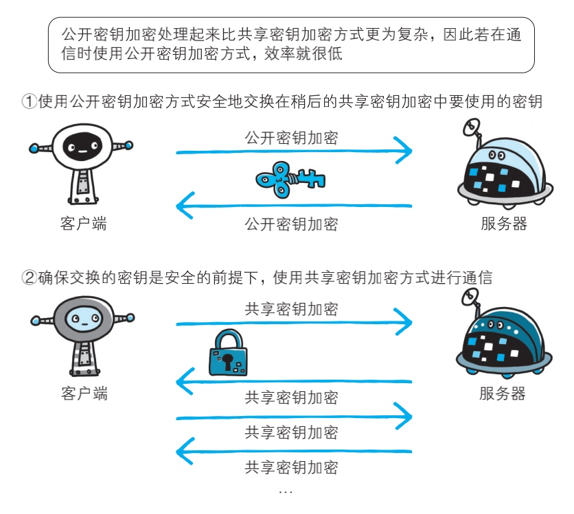
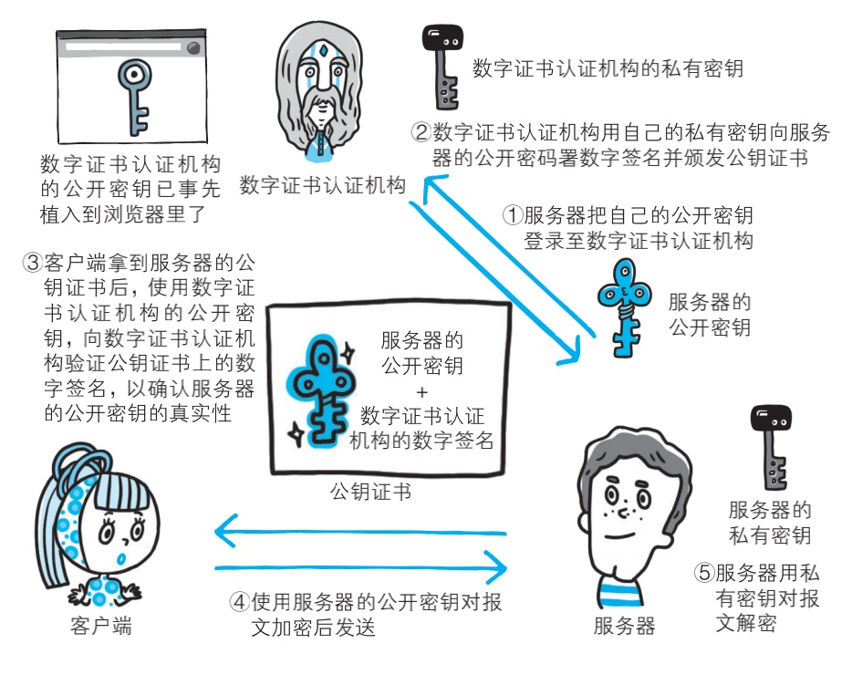
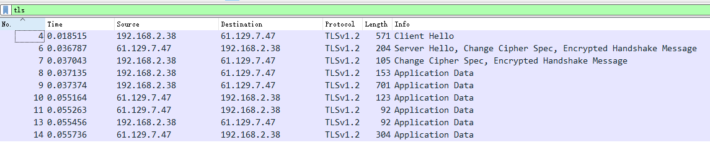

# HTTPS

## HTTP 的问题

- 窃听: 通信使用明文
  - 通信加密: HTTPS
  - 内容加密: body 加密
- 伪装: 没有验证双方身份
  - 客户端, 服务器都可能是伪装的
  - 来着不拒: Dos 攻击
- 篡改: 无法证明报文完整性
  - 请求/响应的内容可能有误: 中间人攻击

## HTTPS

HTTP + 加密 + 认证 + 完整性保护 = HTTPS

如何保证公开秘钥？

密钥协商

- 秘钥传输
- 秘钥交换

### RSA秘钥协商

1. 浏览器内部植入CA的公钥
2. 服务器向CA提出公钥申请
3. CA的私钥 + 服务器的公钥 = 数字签名
4. 服务器公钥 + 数字签名 = 证书
5. 服务器发送证书给客户端
6. 浏览器用CA的公钥验证证书，得到服务器的公钥
7. 客户端用服务器的公钥加密一个对称加密的秘钥给服务端
8. 后续回话内容都用对称秘钥加解密

#### 握手流程

1. Client Hello（Random，支持的密码套件、压缩方法，tls版本等）
2. Server Hello（Random，确定的密码套件、压缩方法，tls版本等）
3. 服务端发送证书给客户端
4. 客户端验证证书，得到公钥
5. 客户端生成一个随机数 pre master secret 用公钥加密，发给服务端
6. 服务端用私钥解密，得到pre master secret
7. 客户端、服务端都可以用三个随机数 生成 对话密码  后续的对称加密用的秘钥

#### 缺点

- 不具有前向安全性

整个握手阶段都不加密，是明文的。因此，如果有人窃听通信，他可以知道双方选择的加密方法，以及三个随机数中的两个。整个通话的安全，只取决于第三个随机数（Premaster secret）能不能被破解。

采用DH算法后，Premaster secret不需要传递，自己端生成。

::: info 前向安全性

长期使用的主密钥泄漏不会导致过去的会话密钥泄漏

:::

### ECDHE

发展：DH > DHE > ECDHE

TLS_ECDHE_RSA_WITH_AES_128_GCM_SHA256

- TLS：协议
- ECDHE：密钥交换（协商）算法
- RSA：签名算法（证书里的公钥必须是RSA的公钥）
- AES_128_GCM AES：会话加密算法，用于加密消息流
- SHA256  散列（摘要）算法

#### 握手流程

1. 【c > s】【Client Hello】（客户端生成的Random，支持的密码套件、压缩方法，tls版本等）**【第一次握手】**

2. 【s > c】【Server Hello】（服务端生成的Random，确定的密码套件、压缩方法，tls版本等）

3. 【s > c】【Certificate】 用于向客户端证明服务端身份

4. 【s > c】【Server Key Exchange】 服务端生成一对公钥和私钥，发送公钥给客户端，客户端用于生成pre master secret，为了保证这个公钥不被篡改，用rsa签名

5. 【s > c】【Server Hello Done】 告诉客户端招呼打完了 **【第二次握手】**

   - 此时客户端可以根据服务端发过来的公钥生成pre master secret
   - 客户端在根据 客户端生成的Random + 服务端生成的Random +pre master secret 得到master secret

6. 【c > s】【Client Key Exchange】 客户端生成一对公钥和私钥，发送公钥给服务端，服务端用于生成pre master secret

   - 此时服务端可以根据客户端发过来的公钥生成pre master secret

   - 服务端在根据 客户端生成的Random + 服务端生成的Random +pre master secret 得到master secret
   - 此时，客户端和服务端各自生成的master secret应该是一样，这个秘钥也作为后续对称加密的秘钥

7. 【c > s】【Change Cipher Spec】 通知服务端：改变加密规范，后续通信用对称加密

8. 【c > s】【Encrypted Handshake Message】 使用master secret加密之前的消息，如果服务端能对这个加密报文校验成功，那么就说明master secret是正确的**【第三次握手】**

9. 【s > c】【Change Cipher Spec】 通知客户端：改变加密规范  后续通信用对称加密

10. 【s > c】【Encrypted Handshake Message】 使用master secret加密之前的消息，如果客户端能对这个加密报文校验成功，那么就说明master secret是正确的**【第四次握手】**

#### Session ID

接上次会话，没有发送证书，秘钥协商过程

## reference

<http://www.ruanyifeng.com/blog/2014/09/illustration-ssl.html>

<https://blog.csdn.net/summer_fish/article/details/125279853>

<https://medium.com/swlh/understanding-ec-diffie-hellman-9c07be338d4a>

<https://ciphersuite.info/>

<https://blog.csdn.net/mrpre/category_7152768.html>
