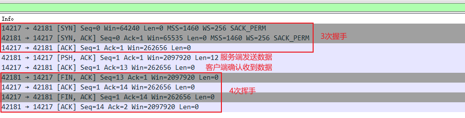

# tcp

## 首部


- 最少20B

## Seq

序列号,SYN 时初始化, 随机数

- 如果SYN标志被设置为1，则这是初始序列号。实际第一个数据字节的序列号以及相应ACK中的确认号将是该序列号加1。
- 如果SYN标志未设置为0，则这是当前会话中该段第一个数据字节的累积序列号。
- FIN标志为1，对应ACK+1
- SYN FIN 不发送数据，但占一个序号

## Ack

- 已经接收到所有之前的字节
- 期望下次收到的序列号,ACK=收到的Seq+数据字节数
- 每个端点发送的第一个ACK会确认对方初始序列号本身，但不包含数据

## 标志位

- URG（Urgent）：紧急标志，表示数据包中有紧急数据，优先于其他数据处理。
- ACK（Acknowledgment）：确认标志，表示已收到对方的数据包，并确认序列号和确认号。
  - 客户端发送的初始 SYN 数据包之后的所有数据包都应设置此标志
- PSH（Push）：推送标志，表示数据包中的数据应该立即发送给应用程序，而不是缓存起来。
- RST（Reset）：重置标志，表示连接已关闭或拒绝，通常用于异常情况。
- SYN（Synchronization）：同步标志，表示发起一个新的连接，并指定初始序列号。
  - 只有从每一端发送的第一个数据包才应设置此标志
- FIN（Finish）：完成标志，表示结束一个连接，并释放资源。

## 三次握手(Three-way Handshake) 建立连接


1. 客户端发送一个SYN报文，指定一个初始序列号x，并进入SYN_SEND状态。
    - 初始序列号: ISN，Initial Sequence Number
2. 服务器收到SYN报文后，回复一个SYN+ACK报文，指定一个初始序列号y，并确认客户端的序列号为x+1，然后进入SYN_RECV状态。
3. 客户端收到SYN+ACK报文后，回复一个ACK报文，确认服务器的序列号为y+1，并进入ESTABLISHED状态。服务器也收到客户端的确认后，进入ESTABLISHED状态。

前两次不能发送数据,第三次可以

## 四次挥手(Four-way Wavehand) 终止连接


1. 客户端发送FIN报文，由ESTABLISHED状态进入FIN_WAIT_1状态，等待服务端的ACK报文
    - FIN报文的发送表示客户端不再发送数据
2. 服务端收到FIN报文后，回复ACK报文，由ESTABLISHED状态进入CLOSE_WAIT状态，等待服务端的FIN报文。客户端收到ACK后，进入FIN_WAIT_2状态
    - 服务端还是可以发送数据给客户端
3. 服务端发送FIN报文，进入LAST_ACK状态，等待客户端的ACK报文
    - FIN报文的发送表示服务端不再发送数据
4. 客户端收到FIN报文后，回复ACK报文后，进入TIME_WAIT状态，等待一段时间后，确认连接关闭进入CLOSE状态，服务段收到ACK后，也进入CLOSE状态



1. 第一次握手(SYN):客户端生成ISN_C=0,即Seq=ISN_C=0
2. 第二次握手(SYN+ACK):服务端生成ISN_S,即Seq=ISN_S=0;期望下次客户端发的Seq是1,所以Ack=1
    - 对应客户端第一次SYN,相应ACK中的确认号将是该序列号加1,所以ACK=1
3. 第三次握手(ACK):服务端期望Seq是1,所以ISN_C+=1,Seq=ISN_C=1,期望下次服务端发的Seq是1(相应ACK中的确认号将是该序列号加1),所以Ack=1
    - 对应服务端第一次SYN,相应ACK中的确认号将是该序列号加1,所以ACK=1
4. 服务端发送数据:客户端期望Seq是1,所以ISN_S+=1,Seq=ISN_S=1,期望下次客户端发的Seq是1,所以Ack=1,Len=12,发送数据为12个字节
5. 收到的Ack是1,所以Seq是1,收到12字节数据 Ack=ISN_C+12=13
6. 第一次挥手: 上次收到ACK=13, 所以Seq=13, Ack=1,收到1字节
7. 第二次挥手: 上次收到ACK=1, 所以Seq=1, Ack=14,收到14字节,因为收到一个FIN,13+1
8. 第三次挥手: 上次收到ACK=1, 所以Seq=1, Ack=14,收到14字节
8. 第四次挥手: 上次收到ACK=14, 所以Seq=14, Ack=2,因为收到一个FIN

握手/挥手 isn + 1

传输数据 isn + len

> wireshark 不能捕获localhost

本地主机（localhost）的通信不会经过物理网卡,在操作系统内部的网络协议栈中进行传输

- wireshark捕获时网卡选择 Adapter for loopback traffic capture
- route add 本机ip mask 255.255.255.255 网关ip

tcp-server.js

```js
var net = require('net')

var port = 42181
var host = '127.0.0.1'

var server = net.createServer(socket => {
  socket.on('end', () => {
    console.log(`Server: Client Disconnected`)
  })
})

server.on('connection', socket => {
  console.log(`connected from: ${socket.remoteAddress}:${socket.remotePort}`)
  socket.write('hello client')
  socket.end()
})

server.on('error', err => {
  throw err
})

server.listen(port, host)

```

tcp-client.js

```js
var net = require('net')

var port = 42181
var host = '127.0.0.1'

var client = new net.Socket()

client.connect(port, host, () => {
  console.log(`Connected to Server : ${host} on ${port}`)
})

client.on('data', data => {
  console.log(`Received : ${data}`)
})

client.on('close', data => {
  console.log(`Client: Disconnected from Server`)
})

```
