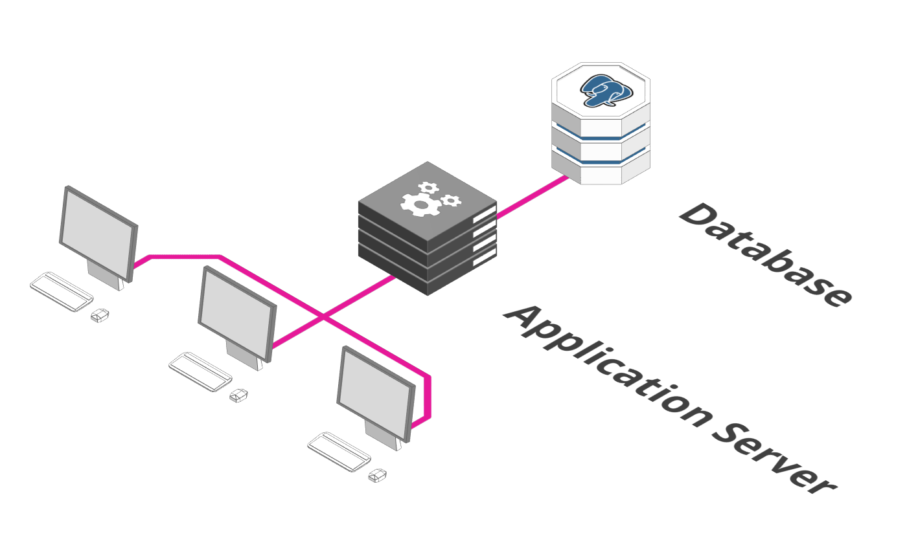
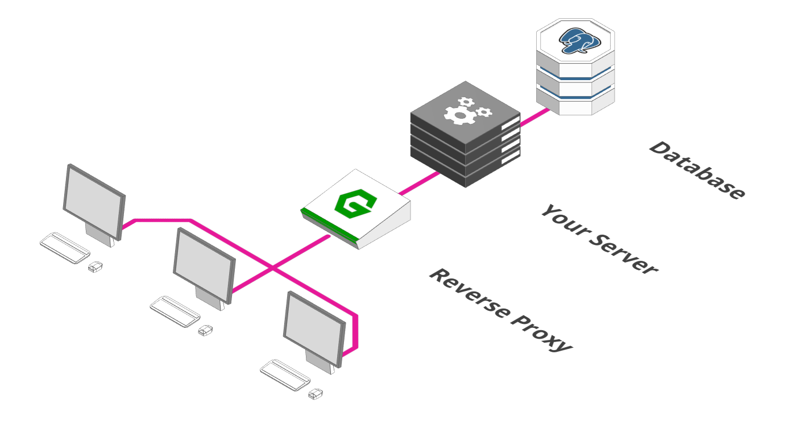
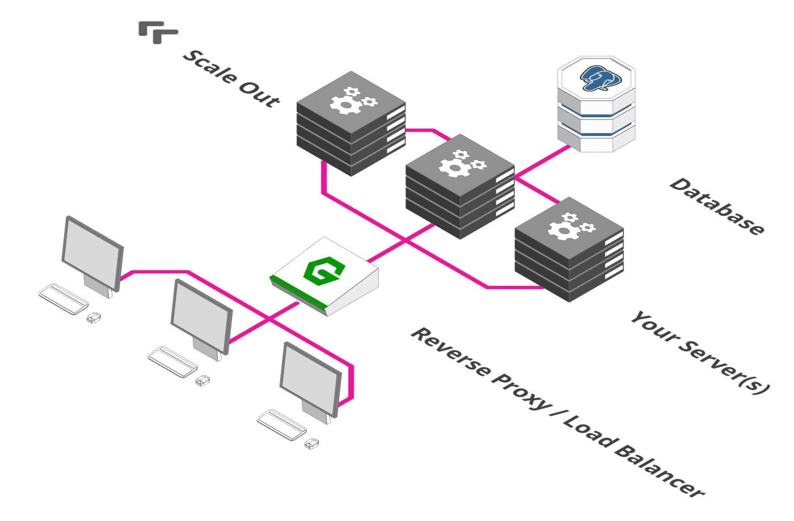
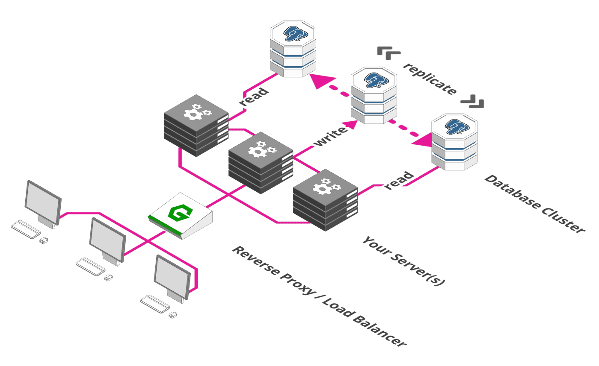
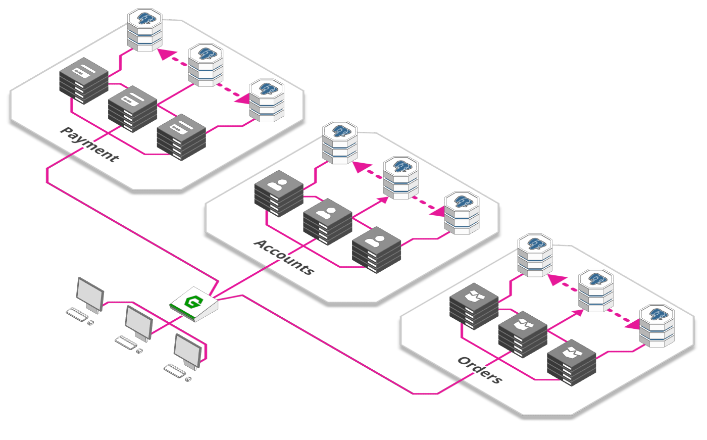
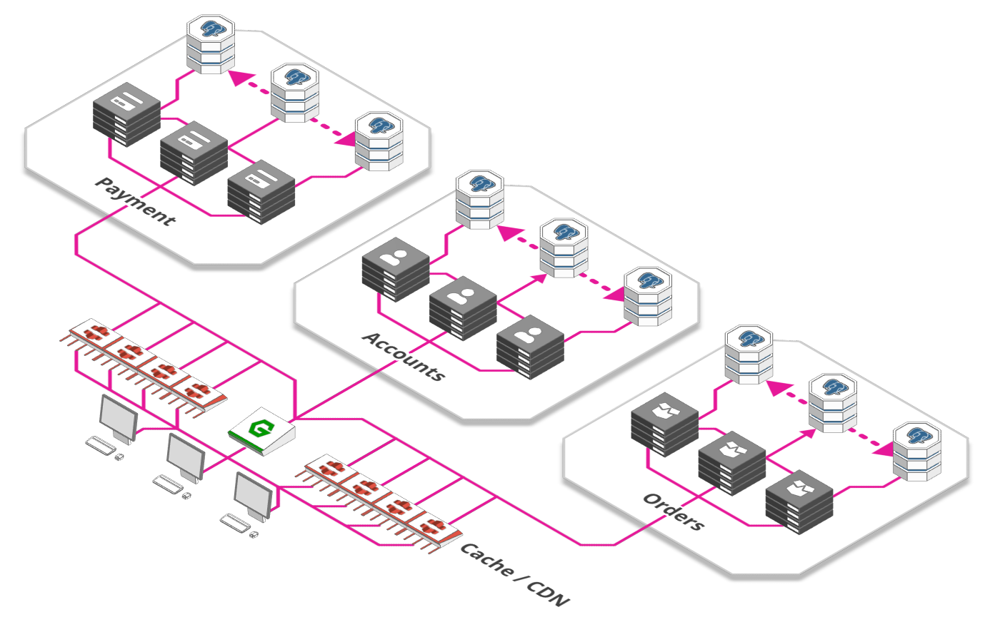
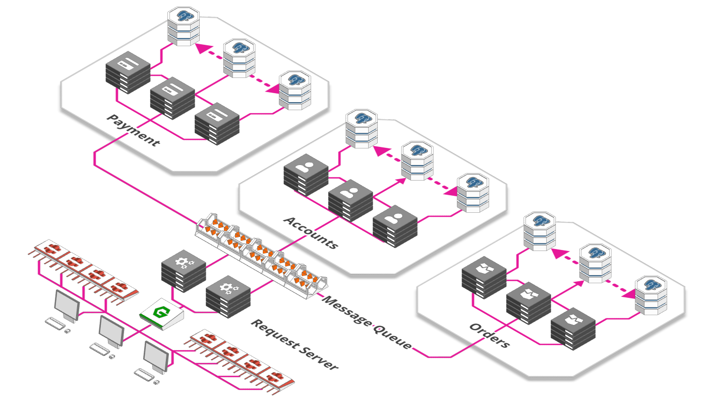
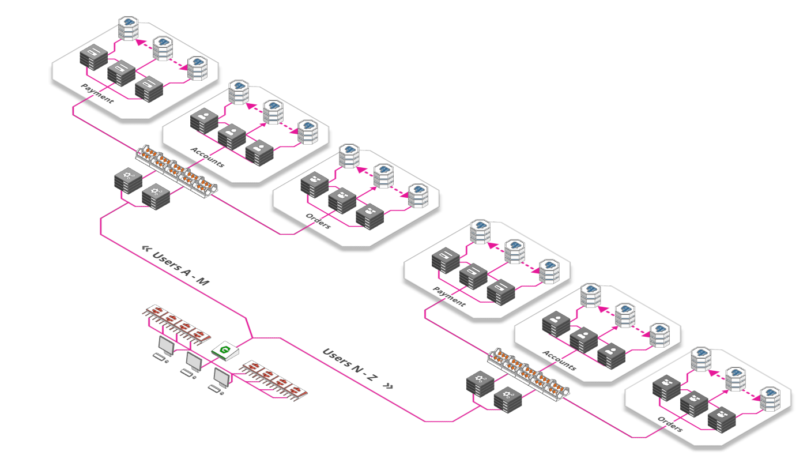
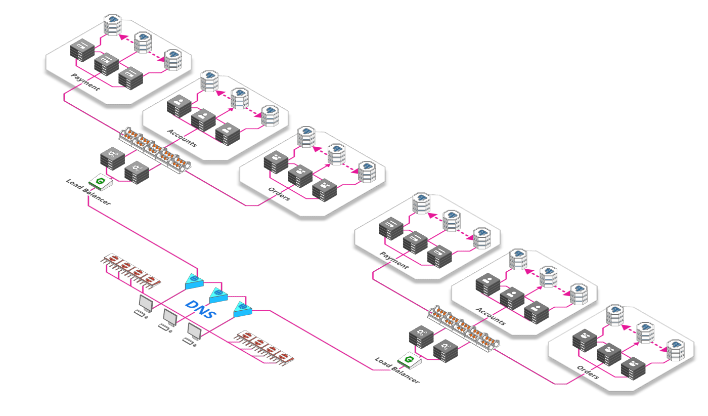

# Scaling webapps

## 一、常规方式

## 二、Reverse Proxy

## 三、Load Balancer

## 四、Database Cluster

## 五、Micro Services

## 六、Cache & CDN

## 七、Message Queue

## 八、Sharding

## 九、Load-balancing the load-balancer

参考：

<https://arcentry.com/blog/scaling-webapps-for-newbs-and-non-techies/>
