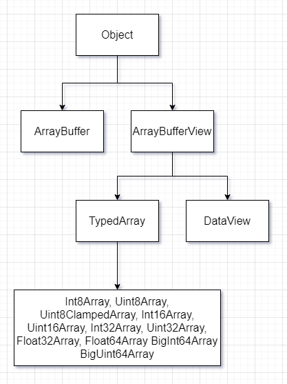

# Binary Data

Blob File...

## ArrayBuffer


Uint8Array —— 将 ArrayBuffer 中的每个字节视为 0 到 255 之间的单个数字（每个字节是 8 位，因此只能容纳那么多）。这称为 “8 位无符号整数”。

- 8位1字节，16 字节 ArrayBuffer，用Uint8Array就相当于存16个小数字

```js
let buffer = new ArrayBuffer(16) // 创建一个长度为 16 的 buffer
let view = new Uint8Array(buffer) // 将 buffer 视为一个 8 位整数的序列
console.log('每个整数占用字节数', Uint8Array.BYTES_PER_ELEMENT) // 1
console.log('存储了多少个整数', view.length) // 16
console.log('buffer大小', view.byteLength) // 16
// 写入一个值
view[0] = 255 // 超过255  2的8次方取模的结果被保存了下来，因为8位最多表示255
// 遍历值
for (let i = 0; i < view.length; i++) {
  console.log(i, view[i])
}
```

- 字节数组,固定长度的原始二进制数据缓冲区
- 不能直接操作 ArrayBuffer 的内容,要操作需要视图
- 视图分为 TypedArray 或 DataView
  - TypedArray 类型化的数组 Int8Array等
  - DataView 未类型化视图 不用考虑不同平台的字节序问题
- ArrayBufferView 是所有视图的总称
- BufferSource 是 ArrayBuffer 或 ArrayBufferView 的总称



ArrayBufferView 抽象类 ArrayBuffer 上“视图”之一的实例的基类，

DataView 一个可以从 二进制ArrayBuffer 对象中读写多种数值类型的底层接口，使用它时，不用考虑不同平台的字节序问题

- 每个十六进制中的数字代表4个比特

9499938 十六进制 90f522
大端字节序：90f522 》10010000 11110101 00100010
小端字节序：22f590 》11110101 00100010 10010000

## Blob

Blob 由一个可选的字符串 type（通常是 MIME 类型）和 blobParts 组成 —— 一系列其他 Blob 对象，字符串和 BufferSource

- Blob 对象是不可改变的
- slice 获取片段（分片）


## file

- 继承自Blob, 多了name, lastModified等属性
- `<input type="file">`

## FileReader

读取Blob中的数据

- readAsArrayBuffer(blob) —— 转换为 ArrayBuffer，
- readAsText(blob, [encoding]) —— 转换为字符串（TextDecoder 的一个替代方案），
- readAsDataURL(blob) —— 转换为 base64 的 data url。

## Data URL

```txt
data:[<mediatype>][;base64],<data>
```

## Object URL

```txt
blob:<origin>/<uuid>
```

- 浏览器内部为每个通过 URL.createObjectURL 生成的 URL 存储了一个 URL → Blob 映射。因此，此类 URL 很短，但可以访问 Blob。
- 生成的 URL（即其链接）仅在当前文档打开的状态下才有效。它允许引用 ``、`<a>` 中的 Blob，以及基本上任何其他期望 URL 的对象。
- Blob 本身只保存在内存中的。浏览器无法释放它。在文档退出时（unload），该映射会被自动清除，因此 Blob 也相应被释放了。
- 手动释放 URL.revokeObjectURL()

## ReadableStream

```js
fetch('https://fetch-progress.anthum.com/30kbps/images/sunrise-baseline.jpg')
.then(response => {
  const contentEncoding = response.headers.get('content-encoding')
  const contentLength = response.headers.get(contentEncoding ? 'x-file-size' : 'content-length')
  const total = parseInt(contentLength, 10)
  let loaded = 0
  return new Response(
    new ReadableStream({
      start(controller) {
        const reader = response.body.getReader()
        read()
        function read() {
          reader.read().then(({ done, value }) => {
            if (done) {
              controller.close()
              return
            }
            loaded += value.byteLength
            console.log(Math.round((loaded / total) * 100) + '%')
            controller.enqueue(value)
            read()
          })
        }
      },
    })
  )
})
.then(response => response.blob())
.then(data => {
  // 下载完成
  // document.getElementById('img').src = URL.createObjectURL(data)
})
```

## 下载

利用a标签href,将 Data URL 或 Object URL 赋值给href,触发click事件

## 怎么产生

- 网络资源 ajax 请求一个图片
- 本地资源 input file 选择一个文件

```js
const image = document.querySelector('.my-image')
// 网络资源
fetch('./googlelogo_color_272x92dp.png')
  .then(response => response.blob())
  .then(blob => {
    const objectURL = URL.createObjectURL(blob)
    image.src = objectURL
  })
// 本地资源
document.getElementById('file1').onchange = function (e, a) {
  const objectURL = URL.createObjectURL(e.target.files[0])
  image.src = objectURL
}
```

## 类型转换


### String -> TypedArray

```js
const str = 'abc'
// 1 String -> Blob -> ArrayBuffer -> TypedArray
const reader = new FileReader()
reader.readAsArrayBuffer(new Blob(str.split('')))
reader.onload = function (e) {
  console.log(new Uint8Array(e.target.result))
}
// 2 String -> ArrayBuffer -> TypedArray
new Response(str)
  .arrayBuffer()
  .then(buffer => new Uint8Array(buffer))
  .then(console.log)
// 3 TextEncoder
console.log(new TextEncoder().encode(str))
// 4
const binstr = encodeURIComponent(str).replace(/%([0-9A-F]{2})/g, (_, p1) => {
  return String.fromCharCode('0x' + p1)
})
console.log(new Uint8Array(binstr.split('').map(x => x.charCodeAt(0))))
```

<https://zh.javascript.info/binary>
<https://shanyue.tech/post/binary-in-frontend/#%E4%BA%8C%E8%BF%9B%E5%88%B6%E7%9B%B8%E5%85%B3%E6%95%B0%E6%8D%AE%E7%B1%BB%E5%9E%8B>
