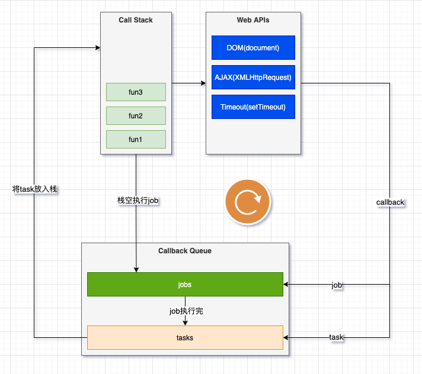

# Event Loop

为了协调事件、用户交互、脚本、渲染、网络等

## 宏队列

macrotask，也叫 tasks

- setTimeout
- setInterval
- setImmediate (Node 独有)
- requestAnimationFrame (浏览器独有)
- I/O
- UI rendering (浏览器独有)

## 微队列

microtask，也叫 jobs

- process.nextTick (Node 独有)
- Promise
- Object.observe
- MutationObserver

只有当没有正在运行的执行上下文并且执行上下文堆栈为空时，才能启动 Job 的执行

栈空时，执行所有 job

job 执行完，拿一个 task 放入栈

栈空时，再执行所有 job

如此往复

.click 导致事件同步调度

代码调用 click，click 再冒泡，第一个 click 走完，栈中还有 script,不会执行 job

[Tasks, microtasks, queues and schedules](https://jakearchibald.com/2015/tasks-microtasks-queues-and-schedules/)

[What the heck is the event loop anyway? | Philip Roberts | JSConf EU](https://www.youtube.com/watch?v=8aGhZQkoFbQ)

[loupe](https://github.com/latentflip/loupe)
