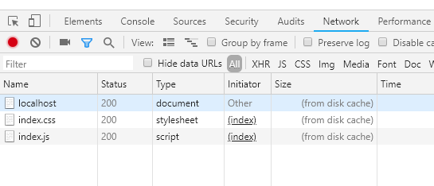
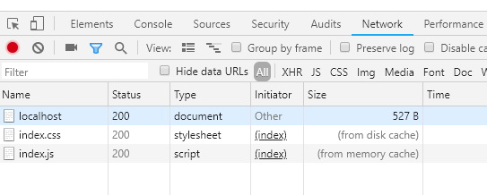
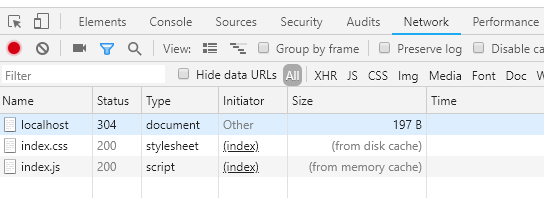

# 前端缓存

## 强缓存

浏览器始终去缓存中取数据，如果有。

`Cache-Control` 通用消息头字段被用于在 http 请求和响应中通过指定指令来实现缓存机制。缓存指令是单向的, 这意味着在请求设置的指令，在响应中不一定包含相同的指令

### 使用

`Cache-Control: public, max-age=<seconds>` 表示在 seconds 秒内再次访问该资源，均使用本地的缓存

- public
  - 表明响应可以被任何对象（包括：发送请求的客户端，代理服务器，等等）缓存，即使是通常不可缓存的内容。（例如：1.该响应没有`max-age`指令或`Expires`消息头；2. 该响应对应的请求方法是 [POST](https://developer.mozilla.org/zh-CN/docs/Web/HTTP/Methods/POST) 。）

- private
  - 表明响应只能被单个用户缓存，不能作为共享缓存（即代理服务器不能缓存它）。私有缓存可以缓存响应内容，比如：对应用户的本地浏览器。

- no-cache
  - 在发布缓存副本之前，强制要求缓存把请求提交给原始服务器进行验证(协商缓存验证)。

- no-store
  - 缓存不应存储有关客户端请求或服务器响应的任何内容，即不使用任何缓存

> Expire 是 HTTP1.0 标准下的字段,可以忽略了

[Cache-Control](https://developer.mozilla.org/zh-CN/docs/Web/HTTP/Headers/Cache-Control)：MDN

### 验证

chrome 打开新标签页，输入网址回车，首页也会命中强缓存，如下图



如果是当前页 F5 或者地址栏回车，首页不会命中强缓存，为什么？？？



## 协商缓存

向服务器验证一下缓存的有效性来确定是否使用缓存，两种方式

### Last-Modified

可能文件内容没有什么变化，但修改时间变了，导致重新下载资源

Response Headers：服务端告诉客户端资源的最后修改时间

再此请求客户端携带以下参数到服务端

`if-Modified-Since` 是否文件被修改了，带上服务器给的Last-Modified

`if-Unmodified-Since` 是否文件没有被修改，带上服务器给的Last-Modified

### Etag

算法服务器决定，hash，文件大小，等，过于复杂消耗服务器资源

Response Headers：服务端告诉客户端资源的唯一标识

在此请求客户端携带以下参数到服务端

`If-None-Match` 如果不匹配

> Etag 优先级大于 Last-Modified

### 验证

协商缓存命中返回 304



> 两类缓存机制可以同时存在，强制缓存的优先级高于协商缓存

## 示例代码

nodejs 做服务端，示例主要参考：[https://github.com/BlackGoldTeam/cache-control-nodejs-demo/blob/master/server.js](https://github.com/BlackGoldTeam/cache-control-nodejs-demo/blob/master/server.js)

```js
const http = require('http');
const fs = require('fs');
const url = require('url');
const path = require('path');
const etag = require('etag');
const fresh = require('fresh');

const server = http.createServer(function(req, res) {
  let filePath, isHtml, isFresh;
  const pathname = url.parse(req.url, true).pathname;
  //根据请求路径取文件绝对路径
  if (pathname === '/') {
    filePath = path.join(__dirname, '/index.html');
    isHtml = true;
  } else {
    filePath = path.join(__dirname, pathname);
    isHtml = false;
  }
  // 读取文件描述信息，用于计算etag及设置Last-Modified
  fs.stat(filePath, function(err, stat) {
    if (err) {
      res.writeHead(404, 'not found');
      res.end('<h1>404 Not Found</h1>');
    } else {
      if (isHtml) {
        // html文件使用协商缓存
        const lastModified = stat.mtime.toUTCString();
        const fileEtag = etag(stat);
        res.setHeader('Cache-Control', 'public, max-age=0');
        res.setHeader('Last-Modified', lastModified);
        res.setHeader('ETag', fileEtag);

        // 根据请求头判断缓存是否是最新的
        isFresh = fresh(req.headers, {
          etag: fileEtag,
          'last-modified': lastModified,
        });
      } else {
        // 其他静态资源使用强缓存
        res.setHeader('Cache-Control', 'max-age=10');
      }
      fs.readFile(filePath, 'utf-8', function(err, fileContent) {
        if (err) {
          res.writeHead(404, 'not found');
          res.end('<h1>404 Not Found</h1>');
        } else {
          if (isHtml && isFresh) {
            //如果缓存是最新的 则返回304状态码
            //由于其他资源使用了强缓存 所以不会出现304
            res.writeHead(304, 'Not Modified');
          } else {
            res.write(fileContent, 'utf-8');
          }
          res.end();
        }
      });
    }
  });
});
server.listen(8080);
console.log('server is running on http://localhost:8080/');
```

## reference

[HTTP 缓存](https://developers.google.com/web/fundamentals/performance/optimizing-content-efficiency/http-caching?hl=zh-cn)：Google Developers

[HTTP 缓存](https://developer.mozilla.org/zh-CN/docs/Web/HTTP/Caching_FAQ)：MDN

[前端缓存最佳实践](https://juejin.im/post/5c136bd16fb9a049d37efc47)

[HTTP----HTTP 缓存机制](https://juejin.im/post/5a1d4e546fb9a0450f21af23)
