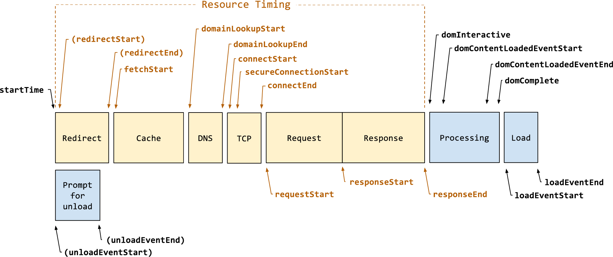

# 指标

## FCP

First contentful paint 首次内容绘制 <https://web.dev/fcp/>

测量页面从开始加载到页面内容的任何部分在屏幕上完成渲染的时间

```js
new PerformanceObserver((entryList) => {
  for (const entry of entryList.getEntriesByName('first-contentful-paint')) {
    console.log('FCP candidate:', entry.startTime, entry);
  }
}).observe({type: 'paint', buffered: true});
```

### 优化

- font-display:swap <https://css-tricks.com/almanac/properties/f/font-display/>
- 避免关键请求链过长 a.js 中 import b.js,b.js 中 import c.js ...
- 移除阻塞渲染的资源
- 缩小css/js
- 删除未使用的css/js
  - Coverage
- 启用文本压缩 gzip
- preconnect,dns-prefetch
- ttfb
- 避免多次页面重定向
- preload
- 缓存

## LCP

Largest contentful paint 最大内容绘制 <https://web.dev/lcp/>

测量页面从开始加载到最大文本块或图像元素在屏幕上完成渲染的时间

```js
new PerformanceObserver((entryList) => {
  for (const entry of entryList.getEntries()) {
    console.log('LCP candidate:', entry.startTime, entry);
  }
}).observe({type: 'largest-contentful-paint', buffered: true});
```

### 优化

fcp

- 避免gif,MPEG4/WebM 视频（来提供动画）和 PNG/WebP来提供静态图片
- 预加载 LCP 元素所用图片

## FID

First input delay 首次输入延迟 <https://web.dev/fid/>

测量从用户第一次与您的网站交互（例如当他们单击链接、点按按钮或使用由 JavaScript 驱动的自定义控件）直到浏览器实际能够对交互做出响应所经过的时间

哪些算是首次输入

- 不连续操作对应的输入事件，如点击、轻触和按键
- 滚动和缩放之类的交互属于连续操作，不是


页面正在发出数个网络请求来获取资源（多为 CSS 和 JS 文件），这些资源下载完毕后，会在主线程上进行处理。
这就导致主线程会阶段性地处于忙碌状态（在图中表示为米黄色任务块）


FID 通常发生在 FCP 和 TTI 之间，因为在此期间，页面已经渲染出部分内容，但交互性还尚不可靠

因为输入发生在浏览器正在运行任务的过程中，所以浏览器必须等到任务完成后才能对输入作出响应。浏览器必须等待的这段时间就是这位用户在该页面上体验到的 FID 值

```js
new PerformanceObserver((entryList) => {
  for (const entry of entryList.getEntries()) {
    const delay = entry.processingStart - entry.startTime;
    console.log('FID candidate:', delay, entry);
  }
}).observe({type: 'first-input', buffered: true});
```

### 优化

- 减少第三方库的影响
- 减少js执行时间
- 最小化主线程工作

## TTI

Time to Interactive 可交互时间 <https://web.dev/tti/>

测量页面从开始加载到视觉上完成渲染、初始脚本（如果有的话）完成加载，并能够快速、可靠地响应用户输入所需的时间


1、先进行First Contentful Paint 首次内容绘制 (FCP)。
2、沿时间轴正向搜索时长至少为 5 秒的安静窗口，其中，安静窗口的定义为：没有长任务且不超过两个正在处理的网络 GET 请求。
3、沿时间轴反向搜索安静窗口之前的最后一个长任务，如果没有找到长任务，则在 FCP 步骤停止执行。
4、TTI 是安静窗口之前最后一个长任务的结束时间（如果没有找到长任务，则与 FCP 值相同）

长任务: 执行时间超过 50 毫秒 (ms) 的任何任务

```js
// Catch errors since some browsers throw when using the new `type` option.
// https://bugs.webkit.org/show_bug.cgi?id=209216
try {
  // Create the performance observer.
  const po = new PerformanceObserver((list) => {
    for (const entry of list.getEntries()) {
      // Log the entry and all associated details.
      console.log(entry.toJSON());
    }
  });
  // Start listening for `longtask` entries to be dispatched.
  po.observe({type: 'longtask', buffered: true});
} catch (e) {
  // Do nothing if the browser doesn't support this API.
}
```

## TBT

Total blocking time 总阻塞时间 <https://web.dev/tbt/>

测量 FCP 与 TTI 之间的总时间，这期间，主线程被阻塞的时间过长，无法作出输入响应


任务的总时间为 560 毫秒，但其中只有 345 毫秒被视为阻塞时间

### 优化

- 避免长的主线程任务
- 消除 300-350 毫秒的点击延迟:`<meta name="viewport" content="width=device-width">`

## CLS

Cumulative layout shift 累积布局偏移 <https://web.dev/cls/>

量整个页面生命周期内发生的所有意外布局偏移中最大一连串的布局偏移分数

每当一个可见元素的位置从一个已渲染帧变更到下一个已渲染帧时，就发生了布局偏移

<video autoplay="" controls="" loop="" muted="" playsinline="" src="./images/layout-instability2.webm"></video>

### 优化

- 避免无尺寸图像
- 避免非合成动画
  - 倾向于选择transform动画，而不是触发布局偏移的属性动画
- font-display

## TTFB

Time to First Byte <https://web.dev/ttfb/>

衡量资源请求与响应的第一个字节开始到达之间的时间的度量



startTime 到 responseStart 的时间

```js
new PerformanceObserver((entryList) => {
  const [pageNav] = entryList.getEntriesByType('navigation');

  console.log(`TTFB: ${pageNav.responseStart}`);
}).observe({
  type: 'navigation',
  buffered: true
});
```

### 优化

- 避免多个页面重定向

- prefetch
- HSTS <https://hstspreload.org/>
- http/2 http/3
- ssg > ssr
