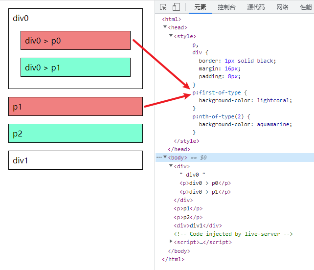

# 基础

## css 选择器

| \*                    | 匹配任何元素                                                                                                       |
| --------------------- | ------------------------------------------------------------------------------------------------------------------ |
| html:root             | 匹配文档的根元素，对于 HTML 文档，就是 HTML 元素                                                                   |
| p                     | 匹配 p 标签                                                                                                        |
| .title                | 匹配 class 为 title 的元素                                                                                         |
| .title :not(p)        | 匹配 class 为 title 的元素下的所有不是 p 标签的元素                                                                |
| p.title               | 匹配 class 为 title 的 p 标签                                                                                      |
| #img                  | 匹配 id 为 img 的元素                                                                                              |
| .title,span           | 匹配 class 为 title 的元素和 span 标签                                                                             |
| .title p              | 匹配 class 为 title 的元素下的 p 标签                                                                              |
| .title > p            | 匹配 class 为 title 的元素下的一级子元素中的 p 标签                                                                |
| h1 + p + p            | 匹配 h1 标签后一个 p 标签的后一个 p 标签                                                                           |
| p~p                   | 匹配任何在 p 标签之后的同级 p 标签                                                                                 |
| .show ::selection     | 匹配用户当前选中的元素，一般是选择文字后可以改变颜色和背景色                                                       |
| li:empty              | 匹配一个不包含任何子元素的元素，注意，文本节点也被看作子元素                                                       |
| p[class]              | 匹配具有 class 属性的 p 标签                                                                                       |
| p[class=title]        | 匹配 class 为 title 的 p 标签                                                                                      |
| a[title~=链接]        | 匹配 title 属性具有多个空格分隔的值,其中有一个值为"链接"的 a 标签                                                  |
| a[title\|=链接]       | 匹配 title 属性由连字符分隔(-)组成,以"链接"开头的 a 标签                                                           |
| p[class^="p"]         | 匹配 class 以"p"开头的 p 标签                                                                                      |
| a[href$=".com"]       | 匹配 href 以".com"结尾的 a 标签                                                                                    |
| a[title*="外链"]      | 匹配 title 包含"外链"的 a 标签                                                                                     |
| h1:lang(cn)           | 匹配 lang 属性等于 cn 的元素                                                                                       |
| a:link                | 匹配未被点击的元素                                                                                                 |
| a:visited             | 匹配已被点击的元素                                                                                                 |
| a:active              | 匹配鼠标按下后，还没有释放开的元素                                                                                 |
| a:hover               | 匹配鼠标悬停在某个元素上时的效果                                                                                   |
| p:first-line          | 匹配 p 标签的第一行                                                                                                |
| p:first-letter        | 匹配 p 标签的第一字母                                                                                              |
| h1:before             | 在 h1 标签之前插入生成的内容                                                                                       |
| h1:after              | 在 h1 标签之后插入生成的内容                                                                                       |
| input:focus           | 匹配当前获得焦点的元素                                                                                             |
| input:enabled         | 匹配表单中激活的元素                                                                                               |
| input:disabled        | 匹配表单中禁用的元素                                                                                               |
| input:checked         | 匹配表单中被选中的 radio（单选框）或 checkbox（复选框）元素                                                        |
| p:nth-child(2)        | 匹配其父元素的第 n 个子元素                                                                                        |
| p:nth-last-child(2)   | 匹配其父元素的倒数第 n 个子元素                                                                                    |
| p:nth-of-type(2)      | 与:nth-child()作用类似，但是仅匹配使用同种标签的元素                                                               |
| p:nth-last-of-type(2) | 与:nth-last-child() 作用类似，但是仅匹配使用同种标签的元素                                                         |
| p:first-child         | 匹配父元素的第一个子元,p必须是某个父节点的第一个子元素素                                                                                           |
| p:last-child          | 匹配父元素的最后一个子元素，等同于:nth-last-child(1)                                                               |
| p:first-of-type       | 匹配父元素下使用同种标签的第一个子元素,某个父节点的子元素中第一个p元素，等同于:nth-of-type(1)                                                      |
| p:last-of-type        | 匹配父元素下使用同种标签的最后一个子元素，等同于:nth-last-of-type(1)                                               |
| p:only-child          | 匹配父元素下仅有的一个子元素，等同于:first-child:last-child 或 :nth-child(1):nth-last-child(1)                     |
| p;only-of-type        | 匹配父元素下使用同种标签的唯一一个子元素，等同于:first-of-type:last-of-type 或 :nth-of-type(1):nth-last-of-type(1) |
| p:nth-child(odd)      | 奇数行                                                                                                             |
| p:nth-child(even)     | 偶数行                                                                                                             |
| p:nth-child(3n+4)     | 3n+4，第 4 行开始，隔 3 行换色                                                                                     |

参考：<http://lab.tianyizone.com/selectors/>

示例：<http://linxz.github.io/tianyizone/selector_tree.html>

## class 命名

### 常见 class 关键词

- 布局类：header, footer, container, main, content, aside, page, section
- 包裹类：wrap, inner
- 区块类：region, block, box
- 结构类：hd, bd, ft, top, bottom, left, right, middle, col, row, grid, span
- 列表类：list, item, field
- 主次类：primary, secondary, sub, minor
- 大小类：s, m, l, xl, large, small
- 状态类：active, current, checked, hover, fail, success, warn, error, on, off
- 导航类：nav, prev, next, breadcrumb, forward, back, indicator, paging, first, last
- 交互类：tips, alert, modal, pop, panel, tabs, accordion, slide, scroll, overlay,
- 星级类：rate, star
- 分割类：group, seperate, divider
- 等分类：full, half, third, quarter
- 表格类：table, tr, td, cell, row
- 图片类：img, thumbnail, original, album, gallery
- 语言类：cn, en
- 论坛类：forum, bbs, topic, post
- 方向类：up, down, left, right
- 其他语义类：btn, close, ok, cancel, switch; link, title, info, intro, more, icon; form, label, search, contact, phone, date, email, user; view, loading…

### 制定简单规则

- 以中划线连接，如.item-img
- 使用两个中划线表示特殊化，如.item-img.item-img--small 表示在.item-img 的基础上特殊化
- 状态类直接使用单词，参考上面的关键词，如.active, .checked
- 图标以 icon-为前缀（字体图标采用.icon-font.i-name 方式命名）。
- 模块采用关键词命名，如.slide, .modal, .tips, .tabs，特殊化采用上面两个中划线表，如.imgslide--full, .modal--pay, .tips--up, .tabs--simple
- js 操作的类统一加上 js-前缀
- 不要超过四个 class 组合使用，如.a.b.c.d

## 样式优先级

优先级 从高到底

- 用户代理 !important
  - 浏览器内置
- 用户设置 !important
  - 浏览器插件注入
- @layer !important
- 开发者设置 !important
- 开发者设置
  - 通配符选择器
  - 标签选择器
  - 类、属性选择器
  - id 选择器
  - 内联
- @layer
- 用户设置
- 用户代理
