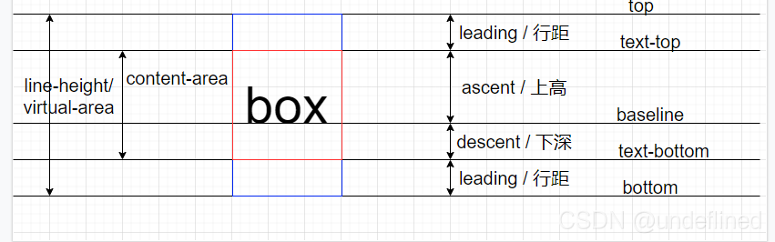
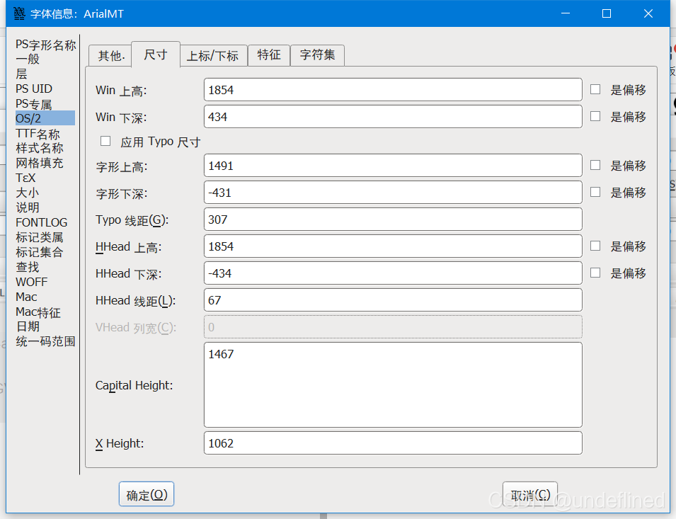
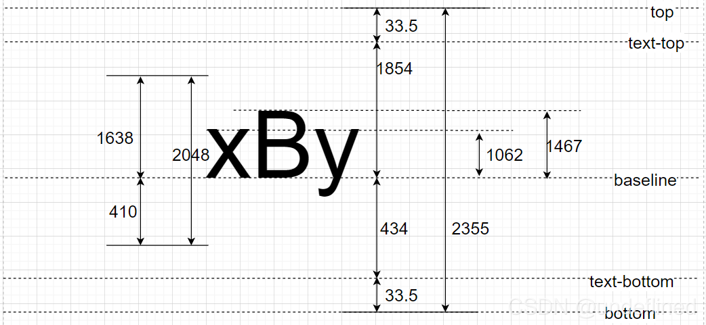
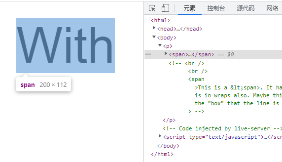
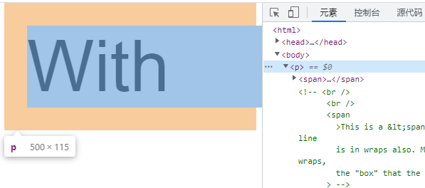
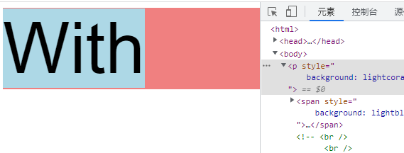
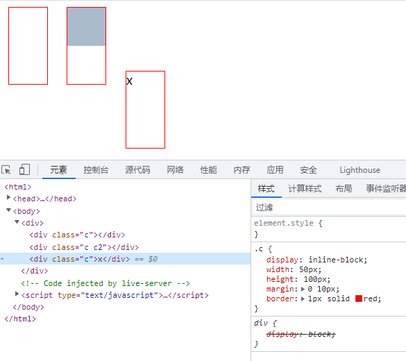
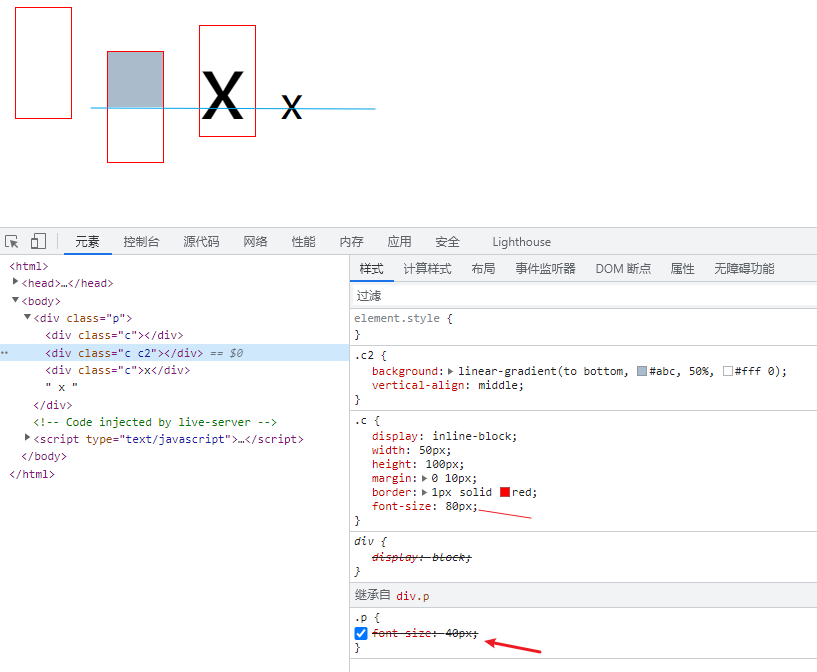
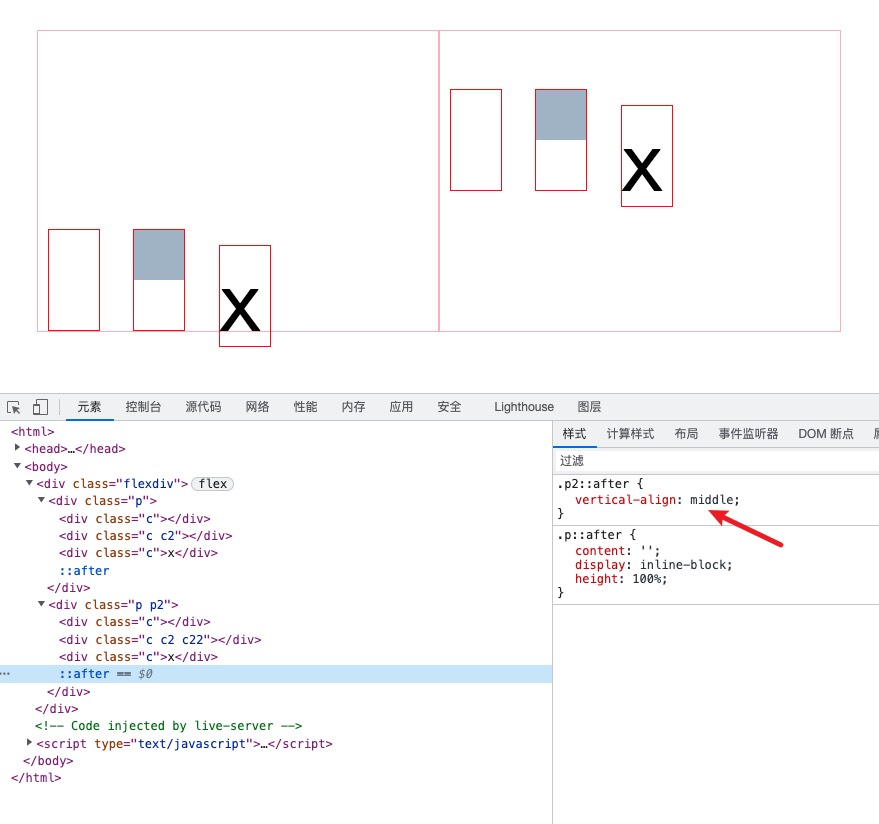
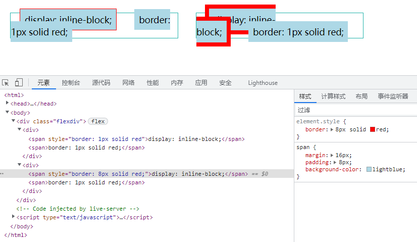

# line-height

两基线的间距


## 基线

- 4线3格的第3条线
- x 的下边缘

vertical-align:middle，middle 指的是基线往上 1/2 x-height 高度，并不是绝对的垂直居中对齐

ex 是 CSS 中的一个相对单位，指的是小写字母 x 的高度，就是 x-height。

内联元素的高度 = 固定高度 + 不固定高度

不固定的部分就是行距

半行距：行距分散在当前文字的上方和下方，上方的半行距不一定等于下方的半行距

- 行距 = 行高 − em-box
- 行距 = line-height - font-size

<https://blog.csdn.net/qq_15601471/article/details/119903856>








Arial 字体为例 2048 对应 font-size 100px 1em的值，也是标准行高

line-height = content-area + 行距 = win上深 + win下深 + 行距

行距 = line-height - font-size

- 上深 1638
- 下深 410
  - 1638 + 410 = 2048

- win上深 1854 text-top 到 baseline

- win下深 434 baseline 到 text-bottom

- 行距 67

  - 上行距：top到text-top

  - 下行距：text-bottom到bottm

  - 图中上行距下行距都为33.5，实际不一定是等分的

- capital Height 1467 大写字母高度
- x-height 1062 小写字母x的高度

- 字形上高 1491 字形达到的最高点
- 字形下深 431 字形达到的最低点

实际计算

line-height = 1638 + 410 + 67 = 2355

100 / 2048 = x / 2355

x = 115

即字体100px时，line-height为115px

capital Height ： 100 / 2048 *1467= 71.630859375 ≈ 72px
x的高度就是 100 / 2048* 1106 = 51.85546875 ≈ 52px，这也是1ex的值（ex可以用来做居中对齐，真居中对齐）；
线距 100 / 2048 * 67 = 3.271484375 ≈ 3

content-area 100 / 2048 * (1854 + 434) =112px



11



行距

大概上行距1px 下行距2px  总共3px



<https://blog.csdn.net/qq_15601471/article/details/119903856>

## IFC

- 内容区域（content area）。可以把文本选中的背景色区域作为内容区域，比背景颜色区域高

line-height > 0   <0   =0

确定 baseline

- inline-table table 第一行的 baseline
- 父元素line box：最后一个inline-box 的 baseline
- 纯文本：字符 x 的baseline
- 替换元素：替换元素的下边缘
- inline-block
  - 内部没有内联元素，或者 overflow 不为 visible，baseline 为 margin 底边缘
  - 内部有内联元素 baseline 是最后一个内联元素的 baseline

- baseline: 使元素的基线与父元素的基线对齐
- sub: 使元素的基线与父元素的下标基线对齐
- super: 使元素的基线与父元素的上标基线对齐
- text-top: 使元素的顶部与父元素的字体顶部对齐
- text-bottom: 使元素的底部与父元素的字体底部对齐
- middle: 元素的中部与父元素的基线加上父元素 x-height 的一半对齐

- 内联元素：基线往上 1/2 x-height 高度 略低于中线
- table-cell：单元格盒子相对于外面的表格行居中对齐



- 默认 vertical-align: baseline
- 第1、2个div baseline 为 margin 底边缘
- 第3个div baseline 为 x 的 baseline



- x-height 参考父元素（40px），而不是自己(80px)，



- after 的高度100%，baseline 在底部
- vertical-align: middle;使得父元素的baseline到了一半的高度

```html
<html>
  <style>
    body {
      padding: 32px;
    }
    .flexdiv {
      display: flex;
    }
    .p {
      width: 400px;
      height: 300px;
      font-size: 40px;
      border: 1px solid lightpink;
    }
    .p::after {
      content: '';
      display: inline-block;
      height: 100%;
    }
    .p2::after {
      vertical-align: middle;
    }
    .c {
      display: inline-block;
      width: 50px;
      height: 100px;
      margin: 0 10px;
      border: 1px solid red;
      font-size: 80px;
    }
    .c2 {
      background: linear-gradient(to bottom, #abc, 50%, #fff 0);
    }
  </style>

  <body>
    <div class="flexdiv">
      <div class="p">
        <div class="c"></div>
        <div class="c c2"></div>
        <div class="c">x</div>
      </div>
      <div class="p p2">
        <div class="c"></div>
        <div class="c c2 c22"></div>
        <div class="c">x</div>
      </div>
    </div>
  </body>
</html>
```

## IFC

创建：

- 块级元素中仅包含内联级别元素
- 当IFC中有块级元素插入时，会产生两个匿名块将父元素分割开来，产生两个IFC

包含一根线的框

内联盒子（inline box）

- 内联元素生成内联盒子
- 纯文本生成匿名内联盒子

- 元素水平方向横向排列
- 如果没有足够的水平空间将所有元素放入一行，则在第一个行框下方创建另一个行框，然后可以跨行拆分单个内联元素
- 当一个内联框被分割成多行时，它在逻辑上仍然是一个单独的框。这意味着任何水平padding、border或margin仅应用于框占用的第一行的开头和最后一行的结尾
- 子元素只会计算横向样式空间(padding、border、margin),垂直方向样式空间不会被计算
  - margin 在垂直方向没有表现
  - padding、border 在垂直方向可以体现，但没有增加高度,不会推开其上方或下方的元素
- 在垂直方向上，子元素会以不同形式来对齐（vertical-align）
- 能把在一行上的框都完全包含进去的一个矩形区域，被称为该行的行框（line box）。行框的宽度是由包含块（containing box）和与其中的浮动来决定。
- line box 一般左右边贴紧其包含块，但float元素会优先排列。
- line box 高度由 CSS 行高计算规则来确定，同个IFC下的多个line box高度可能会不同。
- 当 inline-level boxes的总宽度少于包含它们的line box时，其水平渲染规则由 text-align 属性值来决定。
- 当一个 inline box 超过父元素的宽度时，它会被分割成多个boxes，这些 boxes 分布在多个“line box”中。如果子元素未设置强制换行的情况下，“inline box”将不可被分割，将会溢出父元素

幽灵空白节点 strut

是一个存在于每个“行框盒子”前面，同时具有该元素的字体和行高属性的0宽度的内联盒

line-height > baseline > line box > block box > block


