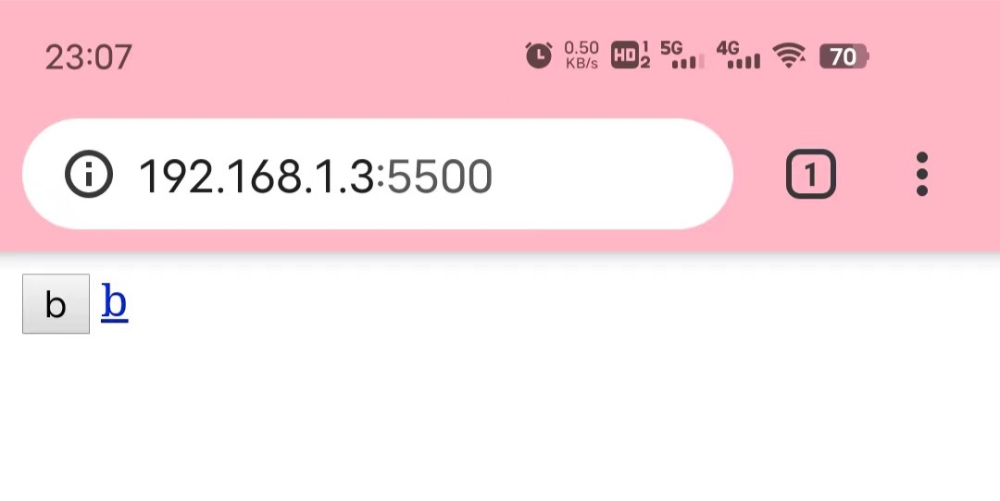

# theme

## prefers-color-scheme

css

```css
@media (prefers-color-scheme: light) {
  body {
    background: #FFF;
    color: #333;
  }
}
@media (prefers-color-scheme: dark) {
  body {
    background: #333;
    color: #FFF;
  }
}
```

js

```js
const darkThemeMq = window.matchMedia("(prefers-color-scheme: dark)");
if (darkThemeMq.matches) {
  // Theme set to dark.
} else {
  // Theme set to light.
}
```

快速实现暗黑模式

```css
@media (prefers-color-scheme: dark) {
  html, img {
    filter: invert(1) hue-rotate(180deg);
  }
}
```

debugging

Customise and control DevTools > More tools > Rendering

## color-scheme

指定元素的配色方案 相当于更改系统颜色

范围：表单控件、滚动条和 CSS 系统颜色的使用值

css系统颜色

- buttonface
- buttontext

手动指定了颜色，则失效

整个页面

```css
:root {
  color-scheme: dark;
  color-scheme: light dark;
}
```

## theme-color

```html
<meta name="theme-color" content="#4285f4">
<meta name="theme-color" media="(prefers-color-scheme: light)" content="white">
<meta name="theme-color" media="(prefers-color-scheme: dark)" content="black">
```



dark 模式下没效果，不知道为啥
