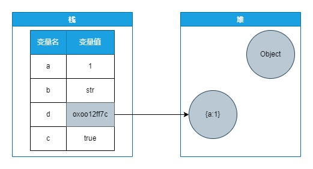

# JavaScript 数据类型

## 一、数据类型

的变量是没有类型的，只有值才有。变量可以随时持有任何类型的值

基本类型（值类型或者原始类型）：Number、Boolean、String、NULL、Undefined、Symbol(ES6)

复杂类型（应用）：Object（Array、Function、Date 等）

| 分类     | 类型                                                  | 内存中的位置 |
| -------- | ----------------------------------------------------- | ------------ |
| 基本类型 | number、boolean、string、null、undefined、symbol(ES6) | 栈（stack）  |
| 引用类型 | Object（Array、Function、Date 等）                    | 堆（heap）   |

栈内存：栈的优势是，存取速度比堆要快，仅次于寄存器，栈数据可以共享。但缺点是，存在栈中的数据大小与生存期必须是确定的，缺乏灵活性。栈中主要存放一些基本类型的变量（,int, short, long, byte, float, double, boolean, char）和对象句柄。栈有一个很重要的特殊性，就是存在栈中的数据可以共享。

堆内存：堆允许程序在运行时动态地申请某个大小的内存空间。

### 1、bool

#### 假值

"",0,-0,NaN,null,undefined,false

### 2、undefined

undeclared：未声明

Undefined 类型只有一个值，称为 undefined。 任何没有被赋值的变量的值都是未定义的。

``` js
var a;
a; // undefined
b; // ReferenceError: b is not defined
```

- **值**未定义
- 全局对象的一个属性，实际上是一个不允许修改的常量  { [[Writable]]: false, [[Enumerable]]: false, [[Configurable]]: false } `'undefined' in window`
- undefined不是保留字
- void 0 === undefined
- 值派生自null,undefined == null

#### 疑问

- 对象上点一个不存在的属性，为什么时undefined

### 3、null

- 不是全局对象的一个属性 `'null' in window`
- 表示缺少的标识，指示变量未指向任何对象，空对象的指针

### 4、undefined与null

```js
Number(null) // 0
Number(undefined) // NaN
```

#### null表示对象不应该有值

- 作为函数的参数，表示该函数的参数不是对象。
- 作为对象原型链的终点。
- 对象置为“空”应该赋值null，这样也契合`typeof null`

```js
Object.getPrototypeOf(Object.prototype)
// null
Object.create(null)
```

#### undefined表示变量应该有一个值，但是还没有定义

- 变量被声明了，但没有赋值时，就等于undefined。
- 调用函数时，应该提供的参数没有提供，该参数等于undefined。
- 对象没有赋值的属性，该属性的值为undefined。
- 函数没有返回值时，默认返回undefined。
- 非对象置为“空”应该赋值undefined

``` js
var i;
i // undefined

function f(x){console.log(x)}
f() // undefined

var  o = new Object();
o.p // undefined

var x = f();
x // undefined
```

### 包装类型

vue props  ，如何验证？

``` js
props: {
  dicTid: {
    type: String
  },
}

// type:String,Number,Object,Array,自定义构造函数
function assertType(value, type){
  // ...
}

// 1、dicTid:'1'
// 2、dicTid:new String('1')
```

### Number

双精度64位浮点数

标准：ieee 754
$$
\begin{aligned}
& 12.34 = 1 \times 10^1 + 2 \times 10^0 + 3 \times 10^{-1} + 4 \times 10^{-2} \\
& 7.75 = 4 + 2 + 1 + 1 / 2 + 1 / 4 = 1 \times 2^2 + 1 \times 2^1 + 1 \times 2^0 + 1 \times 2^{-1} + 1 \times 2^{-2} = 111.11_2
\end{aligned}
$$

- 对于十进制，小数点的左移右移相当于乘以10或除以10
- 对于二进制，小数点的左移右移相当于乘以2或除以2

科学计数法

- 节省内存空间
- 直观的确定大小

---

二进制科学计数法

$$ {aligned}
\alpha \times 2^n
$$

- 指数基数为2
- $\mid a \mid >= 1 且 \mid a \mid < 2$
- n为整数

$$
7.75 = 111.11_2 = 1.1111 \times 2^2
$$

#### IEEE 754定义

<https://zh.wikipedia.org/zh-hans/IEEE_754>


- sign：0表示正数，1表示负数
- exponent： 指数值加上一个偏移值，偏移值为：$2^{n-1}-1$，其中的n为存储指数的比特位长度
- fraction：小数部分（最高位1规定不显示存储）

32位单精度

- 1位符号位，8位指数位，23位小数位；偏移值127
- $n=(-1)^{sign} \times (1+小数) \times 2^{指数-127}$

#### 举例

$$
\begin{align}
78 &= 1 \times 2^6 +  0 \times 2^5 + 0 \times 2^4 + 1 \times 2^3 + 1 \times 2^2 +  1 \times 2^1 +  0 \times 2^0 \\
&= 1001110_2 \\
&= 1.001110_2 \times 2^6
\end{align}
$$

- sign为0，exponent为6+127=133=$10000101_2$，fraction为001110

- 0-10000101-00111000000000000000000

$$
-16 = -10000_2 = -1.0000 \times 2^4
$$

- sign为1，exponent为$4+127=131=10000011_2$，fraction为0000

- 1-10000011-00000000000000000000000

$$
7.75 = 111.11_2 = 1.1111 \times 2^2
$$

- sign为0，exponent为$2+127=129=10000001_2$，fraction为0000

- 0-10000001-11110000000000000000000

还原

#### 0.1+0.2


$0.1 = (0.0\dot0\dot0\dot1\dot1)_2=(-1)^0\times2^{-4}\times(1.\dot1\dot0\dot0\dot1)_2$

- sign为0，exponent为$-4+127=123=01111011_2$，fraction为0000

- 0-01111011-10011001100110011001101

$0.2 = 0.1\times2^1=(-1)^0\times2^{-3}\times(1.\dot1\dot0\dot0\dot1)_2$

- sign为0，exponent为$-3+127=124= 01111100_2$，fraction为0000

- 0-01111100-10011001100110011001101

先进行“对位”，将较小的指数化为较大的指数，并将小数部分相应右移
$$
\begin{align}
0.1 &= (-1)^0\times2^{-3}\times(0.1100 1100 1100 1100 1100 110)_2 \\
0.2 &= (-1)^0\times2^{-3}\times(1.1001 1001 1001 1001 1001 101)_2 \\
0.1 + 0.2 &=(-1)^0\times2^{-3}\times(10.0110 0110 0110 0110 0110 011)_2 \\
&= (-1)^0\times2^{-2}\times(1.0011 0011 0011 0011 0011 010)_2 \\
\end{align}
$$

```js
// 0.3
// 0.010011001100110011001100110011001100110011001100110011
// 0.0100110011001100110011001100110011001100110011001101
const str = '0.0100110011001100110011001100110011001100110011001101',
  len = str.length
let e = 0,
  expression = ''
for (let i = 0; i < len; i++) {
  const element = str[i]
  if (element === '.') {
    continue
  }
  expression += element + ' * 2  ' + e-- + (i === len - 1 ? '' : ' + ')
}
console.log(expression)
console.log(eval(expression))
```

#### reference

<https://segmentfault.com/a/1190000008268668>

<https://babbage.cs.qc.cuny.edu/IEEE-754/>

<https://devtool.tech/double-type>

#### 解决方案

<https://github.com/josdejong/mathjs>

<https://github.com/nefe/number-precision>

### 对象

#### 数据属性

- `Configurable`:表示能否通过 delete 删除属性从而重新定义属性，能否修改属性的特性，或者能否把属性修改为访问器属性。默认值为`true`。
- `Enumerable`:表示能否通过 for-in 循环返回属性，默认值`true`。
- `Writable`:表示能否修改属性的值，默认值`true`。
- `Value`:包含这个属性的数据值。读取属性的时候，从这个位置读，写入属性的时候，吧新值保存在这个位置。默认是为`undefined`。

> 要修改属性的默认特性，必须使用 ES5 的 Object.defineProperty()方法，这个方法接受三个参数：属性所在的对象，属性的名字和一个描述符对象。

##### 例子

##### 1 writable,value

```js
var person = {}
Object.defineProperty(person, 'name', {
  writable: false,
  value: 'Nicholas',
})
alert(person.name) //"Nicholas"
person.name = 'Michael'
alert(person.name) //"Nicholas"
```

##### 2 configurable

```js
var person = {};
Object.defineProperty(person, "name", {
    configurable: false,
    value: "Nicholas"
});
alert(person.name);//"Nicholas"
delete person.name;
alert(person.name);//"Nicholas"

var person = {};
Object.defineProperty(person, "name", {
    configurable: false,
    value: "Nicholas"
});
//throws error
Object.defineProperty(person, "name", {
    configurable: true,
    value: "Nicholas"
});
```

> 一旦把属性定义为不可配置的，就不能再把它变回可配置了。

#### 访问器属性

- `Configurable`:表示能否通过 delete 删除属性从而重新定义属性，能否修改属性的特性，或者能否把属性修改为数据属性。默认值为`true`。
- `Enumerable`:表示能否通过 for-in 循环返回属性，默认值`true`。
- `Get`:在读取属性时调用的函数，默认值`undefined`。
- `Set`:在写入属性时调用的函数，默认值`undefined`。

> 访问器属性必须使用`Object.defineProperty()`来定义

##### 例子

```js
var book = {
    _year: 2004,
    edition: 1
};
Object.defineProperty(book, "year", {
    get: function(){
        return this._year;
    },
    set: function(newValue){
        if (newValue > 2004) {
            this._year = newValue;
            this.edition += newValue - 2004;
        }
    }
});
book.year = 2005;
alert(book.edition);   //2
```

- \_year 前面的下划线是一种常用的记号，用于表示只能通过对象方法访问的属性。

- getter 和 setter 可以只指定一种，表示只读或者只写。

#### 定义多个属性

`Object.defineProperties()`

##### 例子

```js
var book = {};
Object.defineProperties(book, {
    _year: {
        value: 2004
    },
    edition: {
        value: 1
    },
    year: {
        get: function(){
            return this._year;
        },

        set: function(newValue){
            if (newValue > 2004) {
                this._year = newValue;
                this.edition += newValue - 2004;
            }
        }
    }
});
book.year = 2005;
alert(book.edition);   //2
```

两个数据属性（\_year 和 edition）和一个访问器属性（year）

#### 读取属性的特性`Object.getOwnPropertyDescriptor`

```js
var book = {};
Object.defineProperties(book, {
    _year: {
        value: 2004
    },
    edition: {
        value: 1
    },
    year: {
        get: function(){
            return this._year;
        },

        set: function(newValue){
            if (newValue > 2004) {
                this._year = newValue;
                this.edition += newValue - 2004;
            }
        }
    }
});
var descriptor = Object.getOwnPropertyDescriptor(book, "_year");
alert(descriptor.value);          //2004
alert(descriptor.configurable);   //false
alert(typeof descriptor.get);     //"undefined"

var descriptor = Object.getOwnPropertyDescriptor(book, "year");
alert(descriptor.value);          //undefined
alert(descriptor.enumerable);     //false
alert(typeof descriptor.get);     //"function"
```

### Map,WeakMap

> WeakMap：其中的键是弱引用的。其键必须是对象，而值可以是任意的

`node --expose-gc server.js`

```js
global.gc()
console.log('start:heapUsed', process.memoryUsage().heapUsed)

let key = new Array(5 * 1024 * 1024).fill(1)
console.log('array:heapUsed', process.memoryUsage().heapUsed)
const map = new Map()

map.set(key, 1)
global.gc()
console.log('map  :heapUsed', process.memoryUsage().heapUsed)

key = null
global.gc()
console.log('null :heapUsed', process.memoryUsage().heapUsed)
```



函数参数按值传递

## 二、类型检测

### 1、typeof

安全：未声明的返回 undefined

返回一个字符串，表示未经计算的操作数的类型

```javascript
// 数值
typeof Math.LN2 === 'number'
typeof Infinity === 'number'
typeof NaN === 'number' // 尽管它是 "Not-A-Number" (非数值) 的缩写
typeof Number(1) === 'number' // Number 会尝试把参数解析成数值

typeof 42n === 'bigint'

// 字符串
typeof `template literal` === 'string'
typeof String(1) === 'string' // String 将任意值转换为字符串，比 toString 更安全

// 布尔值
typeof Boolean(1) === 'boolean' // Boolean() 会基于参数是真值还是虚值进行转换
typeof !!1 === 'boolean' // 两次调用 ! (逻辑非) 操作符相当于 Boolean()

// Symbols
typeof Symbol() === 'symbol'
typeof Symbol('foo') === 'symbol'
typeof Symbol.iterator === 'symbol'

// Undefined
typeof undefined === 'undefined'
typeof declaredButUndefinedVariable === 'undefined'
typeof undeclaredVariable === 'undefined'

// 对象
typeof { a: 1 } === 'object'

// 使用 Array.isArray 或者 Object.prototype.toString.call
// 区分数组和普通对象
typeof [1, 2, 4] === 'object'

typeof new Date() === 'object'
typeof /regex/ === 'object' // 历史结果请参阅正则表达式部分

// 下面的例子令人迷惑，非常危险，没有用处。避免使用它们。
typeof new Boolean(true) === 'object'
typeof new Number(1) === 'object'
typeof new String('abc') === 'object'

// 函数
typeof function() {} === 'function'
typeof class C {} === 'function'
typeof Math.sin === 'function'
```

- 除 Function 外的所有构造函数的类型都是'object'
- `typeof null === "object"`

- `typeof document.all === 'undefined';`
- 在其被声明之前对块中的 `let` 和 `const` 变量使用 `typeof` 会抛出一个 ReferenceError

### 2、instanceof

用于检测构造函数的 `prototype` 属性是否出现在某个实例对象的原型链上。

```js
;[] instanceof Array // true
;[] instanceof Object // true
```

### 3、Object.prototype.toString()

表示该对象的字符串

在**toString**方法被调用时,会执行下面的操作步骤:

1. 如果**this**的值为**undefined**,则返回`"[object Undefined]"`.
2. 如果**this**的值为**null**,则返回`"[object Null]"`.

3. 让*O*成为调用 ToObject(**this)**的结果.
4. 让*class*成为*O*的内部属性[[Class]]的值.

5. 返回三个字符串**"[object ",** *class*, 以及 **"]"**连接后的新字符串

**Object.prototype.toString.call([]).slice(8, -1) === "Array";**

自定义类型 返回 object

``` js
Object.prototype.toString.call('An') // "[object String]"
Object.prototype.toString.call(1) // "[object Number]"
Object.prototype.toString.call(Symbol(1)) // "[object Symbol]"
Object.prototype.toString.call(null) // "[object Null]"
Object.prototype.toString.call(undefined) // "[object Undefined]"
Object.prototype.toString.call(function() {}) // "[object Function]"
Object.prototype.toString.call({ name: 'An' }) // "[object Object]"
```

### 4、 Array.isArray()

```js
var iframe = document.createElement('iframe')
document.body.appendChild(iframe)
xArray = window.frames[window.frames.length - 1].Array
var arr = new xArray(1, 2, 3) // [1,2,3]

// Correctly checking for Array
Array.isArray(arr) // true
Object.prototype.toString.call(arr) // true
// Considered harmful, because doesn't work though iframes
arr instanceof Array // false
```

## 类型转换

<https://tc39.es/ecma262/#sec-type-conversion>

ECMAScript 语言会根据需要隐式执行自动类型转换。 为了阐明某些构造的语义，定义一组转换抽象操作很有用。 转换抽象操作是多态的； 它们可以接受任何 ECMAScript 语言类型的值。 但是这些操作没有使用其他规范类型。

BigInt 类型在 ECMAScript 语言中没有隐式转换； 程序员必须显式调用 BigInt 来转换其他类型的值。

抽象操作 ToPrimitive 接受参数输入（ECMAScript 语言值）和可选参数 preferredType（字符串或数字），并返回包含 ECMAScript 语言值的正常完成或抛出完成。 它将其输入参数转换为非对象类型。 如果一个对象能够转换为多个原始类型，它可以使用可选提示 preferredType 来支持该类型。 它在调用时执行以下步骤：

todo 图

转换算法是：

调用 obj[Symbol.toPrimitive](hint) 如果这个方法存在，
否则，如果 hint 是 "string"
尝试调用 obj.toString() 或 obj.valueOf()，无论哪个存在。
否则，如果 hint 是 "number" 或者 "default"
尝试调用 obj.valueOf() 或 obj.toString()，无论哪个存在。

hint

- default
- string
- number

Date 和 Symbol 覆盖了默认的 ToPrimitive

- Symbol.prototype[Symbol.toPrimitive]
- Date.prototype[Symbol.toPrimitive]

```js
new Date('2022-6-1') - new Date()
new Date('2022-6-1') + new Date() // default
```

```js
let user = {
  name: 'John',
  money: 1000,
  [Symbol.toPrimitive](hint) {
    console.log(`hint: ${hint}`);
    return hint == 'string' ? `{name: "${this.name}"}` : this.money;
  },
};
console.log(`${user}`); // hint: string -> {name: "John"}
console.log(+user); // hint: number -> 1000
console.log(user + 500); // hint: default -> 1500 //不确定是string还是number,hint就是default
```

- toString 方法返回一个字符串 "[object Object]"。
- valueOf 方法返回对象自身

```js
let user = {
  name: 'John',
  money: 1000,
  // 对于 hint="string"
  toString() {
    return `{name: "${this.name}"}`;
  },
  // 对于 hint="number" 或 "default"
  valueOf() {
    return this.money;
  },
};
console.log(`${user}`); // toString -> {name: "John"}
console.log(+user); // valueOf -> 1000
console.log(user + 500); // valueOf -> 1500
```

必须返回一个原始值

```js
const b = new Boolean(false);
console.log(b == b.valueOf());
console.log(b === b.valueOf());
```

```js
if (a == 1 && a == 2 && a == 3) {
  //
}
```

```js
const a = +'1';
const b = !!'0'
```

## 三、相等

<https://dorey.github.io/JavaScript-Equality-Table/>

### 非严格相等  ==

比较前，先隐式转换为相同类型，再比较两个值是否相等

|           | Undefined | Null    | Number                | String                        | Boolean                         | Object                          |
| :-------- | --------- | ------- | --------------------- | ----------------------------- | ------------------------------- | ------------------------------- |
| Undefined | `true`    | `true`  | `false`               | `false`                       | `false`                         | `IsFalsy(B)`                    |
| Null      | `true`    | `true`  | `false`               | `false`                       | `false`                         | `IsFalsy(B)`                    |
| Number    | `false`   | `false` | `A === B`             | `A === ToNumber(B)`           | `A=== ToNumber(B)`              | `A== ToPrimitive(B)`            |
| String    | `false`   | `false` | `ToNumber(A) === B`   | `A === B`                     | `ToNumber(A) === ToNumber(B)`   | `ToPrimitive(B) == A`           |
| Boolean   | `false`   | `false` | `ToNumber(A) === B`   | `ToNumber(A) === ToNumber(B)` | `A === B`                       | `ToNumber(A) == ToPrimitive(B)` |
| Object    | `false`   | `false` | `ToPrimitive(A) == B` | `ToPrimitive(A) == B`         | `ToPrimitive(A) == ToNumber(B)` | `A === B`                       |

- ToNumber(A) 表示尝试在比较前将参数 A 转换为数字，与+A 效果相同
- ToPrimitive(A)通过尝试调用 A 的 A.toString() 和 A.valueOf() 方法，将参数 A 转换为原始值
- // TODO

#### 特例：document.all

```js
// Opera 中`document.attachEvent`(未验证)

// for “modern” browsers
typeof document.all  // 'undefined'
document.all == undefined // true
Object.prototype.toString.call(document.all) // '[object HTMLAllCollection]'

// for ancient browsers eg ie <= 10
typeof document.all  // 'object'
document.all == undefined // false
Object.prototype.toString.call(document.all) // '[object HTMLAllCollection]'

if (document.all) {
  // code that uses `document.all`, for ancient browsers
} else if (document.getElementById) {
  // code that uses `document.getElementById`, for “modern” browsers
}
```

### 严格相等  ===

不进行隐式转换，类型相同，值也相同，就是全等

- 两个 NaN 不是全等的
- +0 和-0 是全等的

### 同值相等  Object.is

与===不同

- 两个 NaN 是相等的
- +0 和-0 是不相等的

### 零值相等

Map，Set使用

与同值相等类似，不过认为+0 和-0 是相等的
