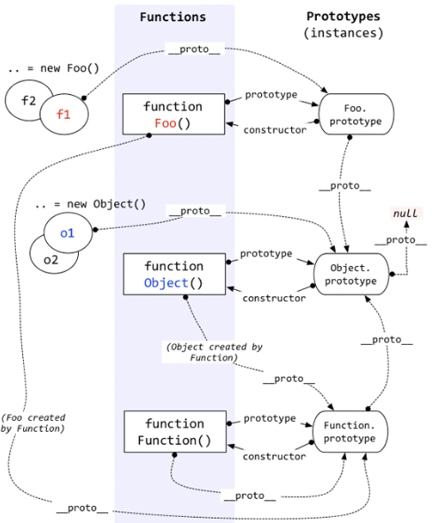

# prototype

---

## 一、创建对象

---

### 1、工厂模式

```js
function createPerson(name, age, job){
    var o = new Object();
    o.name = name;
    o.age = age;
    o.job = job;
    o.sayName = function(){
        alert(this.name);
    };
    return o;
}
var person1 = createPerson("Nicholas", 29, "Software Engineer");
var person2 = createPerson("Greg", 27, "Doctor");

person1.sayName();   //"Nicholas"
person2.sayName();   //"Greg"

```

> 工厂模式虽然解决了创建多个相似对象的问题，但却没有解决对象识别的问题（即怎样知道一个对象的类型）。

---

### 2、构造函数模式

``` js
function Person(name, age, job){
    this.name = name;
    this.age = age;
    this.job = job;
    this.sayName = function(){
        alert(this.name);
    };
}
var person1 = new Person("Nicholas", 29, "Software Engineer");
var person2 = new Person("Greg", 27, "Doctor");

person1.sayName();   //"Nicholas"
person2.sayName();   //"Greg"
```

---

#### constructor属性

``` js
alert(person1.constructor == Person);  //true
alert(person2.constructor == Person);  //true
```

constructor 属性最初是用来标识对象类型的。但是检测对象类型，还是 instanceof 操作符更可靠一些

``` js
alert(person1 instanceof Object);  //true
alert(person1 instanceof Person);  //true
alert(person2 instanceof Object);  //true
alert(person2 instanceof Person);  //true
```

> 创建自定义的构造函数意味着将来可以将它的实例标识为一种特定的类型；而这正式构造函数模式胜过工厂模式的地方
---

#### 将构造函数当做函数

构造函数与其他函数的唯一区别，就是调用他们的方式不同。任何函数，只要通过 new 操作符调用，就可以当做构造函数；不通过 new 操作符调用，那就和普通函数一样。

```js
//当做构造函数使用
var person = new Person("Nicholas", 29, "Software Engineer");
person.sayName();   //"Nicholas"

//作为普通函数使用
Person("Greg", 27, "Doctor");  //adds to window
window.sayName();   //"Greg"

//在另一个对象的作用域中调用
var o = new Object();
Person.call(o, "Kristen", 25, "Nurse");
o.sayName();    //"Kristen"
```

#### 与工厂模式的不同之处

- 没有显示的创建对象
- 直接将属性和方法赋给了 this 对象
- 没有 return 语句

> 按照惯例，构造函数始终都应该以一个大写字母开头，而非构造函数则应该以一个小写字母开头。

创建一个新实例，必须使用 new 操作符，以这种方式调用构造函数会经历 4 个步骤：

1. 创建一个新对象；
2. 将构造函数的作用域赋给新对象（因此 this 就指向了这个新对象）；
3. 执行构造函数中的代码（为这个新对象添加属性）；
4. 返回新对象。

#### 问题

- 每个方法都要在每个实例上重新创建一遍，每个实例上的同名方法是不相等的。

```js
person1.sayName == person2.sayName;  //false
```

把函数定义转义到构造函数外部，定义成了全局函数，这样似乎有些大材小用；如果对象需要定义很多方法，那么就需要更多的全局函数，于是，自定义的应用类型就没有封装性可言了。

## 二、继承 - 原型链

原型链做为实现继承的主要方法。

构造函数，原型，实例之间的关系：每个构造函数都有一个原型对象，原型对象都包含一个指向构造函数的指针，而实例都包含一个指向原型对象的内部指针。

1. 只要创建一个新函数，就会为改函数创建一个 prototype 属性，这个属性指向函数的原型对象。

2. 默认情况下，所有原型对象都会自动获得一个 constructor（构造函数）属性，这个属性包含一个指向 prototype 属性所在函数的指针。即：`Person.prototype.constructor`指向`Person`。

3. 当调用构造与函数创建一个实例后，该实例内部将包含一个指针（内部属性），指向构造函数的原型对象。即：`[[Prototype]]`，浏览器中的`_proto_`。

4. 这个连接存在于实例与构造函数的原型对象之间，而不是存在于实例与构造函数之间。

虽然无法访问到[[Prototype]]，但是可以通过 isPrototypeOf()方法来确定对象之间是否存在这种关系。

ES5 中，有一个 Object.getProtoOf()方法，在所有支持的实现中，返回[[Prototype]]的值。



```js
function SuperType(){
  this.property = true;
}

SuperType.prototype.getSuperValue = function(){
  return this.property;
};

function SubType(){
  this.subproperty = false;
}

//继承了SuperType
SubType.prototype = new SuperType();
SubType.prototype.getSubValue = function (){
  return this.subproperty;
};

var instance = new SubType();
console.log(instance.getSuperValue());  //true
```


调用getSuperValue方法会经历三个步骤：

1. 搜索实例
2. 搜索SubType.Prototype
3. 搜索SupperType.Prototype

### 1、默认原型

所有函数的默认原型都是Object的实例，因此默认原型都会包含一个内部指针，指向Object.Prototype。


### 2、确定原型和实例的关系

```js
alert(instance instanceof Object);    //true
alert(instance instanceof SuperType);  //true
alert(instance instanceof SubType);   //true

alert(Object.prototype.isPrototypeOf(instance));   //true
alert(SuperType.prototype.isPrototypeOf(instance)); //true
alert(SubType.prototype.isPrototypeOf(instance));  //true
```

### 3、多态

给原型添加方法的代码一定要放在替换原型的语句之后。

```js
function SuperType(){
  this.property = true;
}

SuperType.prototype.getSuperValue = function(){
  return this.property;
};

function SubType(){
  this.subproperty = false;
}

//继承了SuperType
SubType.prototype = new SuperType();

//添加新方法
SubType.prototype.getSubValue = function () {
  return this.subproperty
}
//重写超类型中的方法
SubType.prototype.getSuperValue = function (){
  return false;
};

var instance = new SubType();
console.log(instance.getSuperValue());  //false

```

> 通过原型链实现继承时，不是使用对象字面量创建原型方法，因为这样就会重写原型链。

```js
function SuperType() {
  this.property = true
}
SuperType.prototype.getSuperValue = function () {
  return this.property
}
function SubType() {
  this.subproperty = false
}
//继承了SuperType
SubType.prototype = new SuperType()
//使用字面量添加新方法，会导致上一行代码无效
SubType.prototype = {
  getSubValue: function () {
   return this.subproperty
  },
  someOtherMethod: function () {
    return false
  },
}
var instance = new SubType()
console.log(instance.getSuperValue()) //error!
```

### 4.原型链的问题

#### 1.引用类型的问题

```js
function SuperType() {
  this.colors = ['red', 'blue', 'green']
}
function SubType() {}
//继承了 SuperType
SubType.prototype = new SuperType()
var instance1 = new SubType()
instance1.colors.push('black')
console.log(instance1.colors) //"red,blue,green,black"
var instance2 = new SubType()
console.log(instance2.colors) //"red,blue,green,black"
```

#### 2.传参问题

在创建子类实例是，不能向超类型的构造函数中传递参数。

## 三、借用构造函数

函数只不过是特定环境中执行代码的对象，因为通过使用apply()和call()方法也可以在（将来）新创建的对象上执行构造函数

**解决引用类型问题**：

```js
function SuperType() {
  this.colors = ['red', 'blue', 'green']
}
function SubType() {
  //继承了 SuperType
  SuperType.call(this)
}
var instance1 = new SubType()
instance1.colors.push('black')
console.log(instance1.colors) //"red,blue,green,black"
var instance2 = new SubType()
console.log(instance2.colors) //"red,blue,green"
```

**解决传递参数**：

```js
function SuperType(name) {
  this.name = name
}
function SubType(name) {
  //继承了 SuperType 同时还传递了参数
  SuperType.call(this, name)
  //实例属性
  this.age = 29
}
var instance = new SubType('Nicholas')
console.log(instance.name) //"Nicholas";
console.log(instance.age) //29
```

### 借用构造函数的问题

方法都在构造函数中定义，函数无法复用。

## 四、组合继承

将原型链和借用构造函数的方式组合在一起,这样，同在原型上定义方法实现了函数复用，又能保证每个实例都有它自己的属性。

```js
function SuperType(name) {
  this.name = name
  this.colors = ['red', 'blue', 'green']
}

SuperType.prototype.sayName = function () {
  console.log(this.name)
}

function SubType(name, age) {
  //继承属性
  SuperType.call(this, name)
  this.age = age
}

//继承方法
SubType.prototype = new SuperType()

SubType.prototype.sayAge = function () {
  console.log(this.age)
}

var instance1 = new SubType('Nicholas', 29)
instance1.colors.push('black')
console.log(instance1.colors) //"red,blue,green,black"
instance1.sayName() //"Nicholas";
instance1.sayAge() //29
var instance2 = new SubType('Greg', 27)
console.log(instance2.colors) //"red,blue,green"
instance2.sayName() //"Greg";
instance2.sayAge() //27
```

> 组合继承是最常用的继承模式

### 问题

无论什么情况下，都会调用两次超类型构造函数，一次是在创建子类型原型的时候，另一次是在子类型构造函数内部。子类型包含父类型对象的全部实例属性，但不得不在调用子类型构造函数时重写这些属性。

```js
function SuperType(name) {
  this.name = name
  this.colors = ['red', 'blue', 'green']
  console.log('super constructor called')
}
SuperType.prototype.sayName = function () {
  console.log(this.name)
}
function SubType(name, age) {
  SuperType.call(this, name) //第二次调用SuperType()
  this.age = age
}
SubType.prototype = new SuperType() //第一次调用SuperType()
// SubType.prototype.constructor = SubType
SubType.prototype.sayAge = function () {
  console.log(this.age)
}
const subtype = new SubType('tom', 20)
console.log(subtype.name)
console.log(subtype.colors)
console.log(subtype.age)
subtype.sayName()
subtype.sayAge()
```

- 第一次调用：SubType.prototype获得name和colors属性，来自SuperType的实例属性，位于SubType的原型中

- 第二次调用：在新对象上创建了实例属性name和colors，屏蔽了原型中的同名属性


## 五、原型式继承

这种方法没有严格意义上的构造函数，借助原型可以基于已有的对象创建新对象，同时还不必因此创建自定义类型。

```js
function object(o) {
  function F() {}
  F.prototype = o
  return new F()
}
var person = {
  name: 'Nicholas',
  friends: ['Shelby', 'Court', 'Van'],
}
var anotherPerson = object(person)
anotherPerson.name = 'Greg'
anotherPerson.friends.push('Rob')
var yetAnotherPerson = object(person)
yetAnotherPerson.name = 'Linda'
yetAnotherPerson.friends.push('Barbie')
console.log(person.friends) //"Shelby,Court,Van,Rob,Barbie"
```

在object()函数内部，先创建一个临时构造函数，然后将传入的对象作为这个构造函数的原型，最后返回了这个临时类型的新实例。

### 问题

- 不明确类型
- 引用类型被修改

### Object.create()

ES5中新增Object.create()方法规范化了原型式继承。

参数：一个用作新对象原型的对象和一个新对象定义额外属性的对象

```js
var person = {
  name: 'Nicholas',
  friends: ['Shelby', 'Court', 'Van'],
}
var anotherPerson = Object.create(person)
anotherPerson.name = 'Greg'
anotherPerson.friends.push('Rob')
var yetAnotherPerson = Object.create(person)
yetAnotherPerson.name = 'Linda'
yetAnotherPerson.friends.push('Barbie')
console.log(person.friends) //"Shelby,Court,Van,Rob,Barbie"
```

Object.create()方法的第二个参数与Object.defineProperties()的第二参数格式相同,如果该参数被指定且不为 undefined，该传入对象的自有可枚举属性(即其自身定义的属性，而不是其原型链上的枚举属性)将为新创建的对象添加指定的属性值和对应的属性描述符

```js
var person = { name: 'Nicholas', friends: ['Shelby', 'Court', 'Van'] }
var anotherPerson = Object.create(person, { name: { value: 'Greg' } })
console.log(person.name) //"Nicholas"
console.log(anotherPerson.name) //"Greg"
```

## 六、寄生式继承

创建一个仅用于封装继承过程的函数，该函数在内部以某种方式来增强对象，最后再像真地是它做了所有工作一样返回对象。

```js
function object(o) {
  function F() {}
  F.prototype = o
  return new F()
}
function createAnother(o) {
  //通过调用函数创建一个新对象
  var clone = object(o)
  //以某种方式增强这个对象
  o.sayHi = function () {
    console.log('hi')
  }
  //返回这个对象
  return o
}
//使用
var person = {
  name: 'Nicholas',
  friends: ['Shelby', 'Court', 'Van'],
}
var anotherPerson = createAnother(person)
anotherPerson.sayHi() //"hi"
```

> 这种方式做不到函数复用而降低效率，类似构造函数模式

## 七、寄生式组合继承

借用构造函数来继承属性，通过原型链的混成形式来继承方法。

基本思路：不必为了指定子类型的原型而调用父类型的构造函数。

```js
function inheritPrototype(subType, superType) {
  subType.prototype = Object.create(superType.prototype) //创建对象,指定对象
  subType.prototype.constructor = subType //增强对象
}
```

inheritPrototype()函数接收两个参数：子类型构造函数和父类型构造函数。

在函数内部：

1. 创建父类型原型的副本

2. 为创建副本添加constructor属性，从而弥补因重写原型失去默认的constructor属性

3. 将新创建的对象（即副本）赋值给予子类型的原型

```js
function inheritPrototype(subType, superType) {
  subType.prototype = Object.create(superType.prototype) //创建对象,指定对象
  subType.prototype.constructor = subType //增强对象
}
function SuperType(name) {
  this.name = name
  this.colors = ['red', 'blue', 'green']
}
SuperType.prototype.sayName = function () {
  console.log(this.name)
}
function SubType(name, age) {
  SuperType.call(this, name)
  this.age = age
}
inheritPrototype(SubType, SuperType)
SubType.prototype.sayAge = function () {
  console.log(this.age)
}
var instance1 = new SubType('Nicholas', 29)
instance1.colors.push('black')
console.log(instance1.colors) //"red,blue,green,black"
instance1.sayName() //"Nicholas";
instance1.sayAge() //29
var instance2 = new SubType('Greg', 27)
console.log(instance2.colors) //"red,blue,green"
instance2.sayName() //"Greg";
instance2.sayAge() //27
```

这个例子高效体现了它只调用了一次SuperType构造函数，避免了在SubType.prototype上创建不必要的、多余的属性。原型链还能保持不变。

> 寄生组合继承是引用类型最理想的继承范式

## 八、应用

Vue.extend()方法采用了寄生组合继承模式。
<https://github.com/vuejs/vue/blob/dev/src/core/global-api/extend.js#L36-L37>
