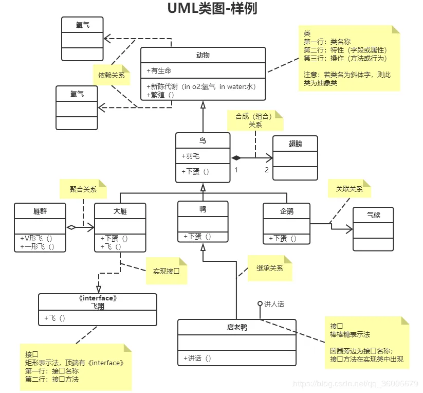

# 习题

## 类型验证

```js
function assertProp(type, value) {
  // ...
}
assertProp(String, 'a')
assertProp(String, new String('a'))
assertProp(Array, [1, 2, 3])
assertProp(Object, { name: '1' })
function Person() {}
assertProp(Person, new Person())
```

## if (a == 1 && a == 2 && a == 3)

```js
// ...
// ...
if (a == 1 && a == 2 && a == 3) {
  // go here
}
```

## 为数组的push方法加一个日志

## 看图写类


