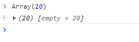
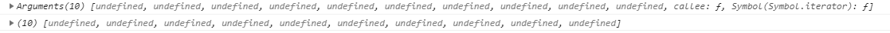

# Array

## 合并数组

push

## 数组复制

concat

Slice

## sort()

默认排序 更具 Unicode 编码位置

String.prototype.codePointAt()

String.FromCodePoint()

指定 compareFn <0 ==0 >0

非 ASCII 字符的字符串 localeCompare

## Array.apply(null, {length: 20})

执行结果：


长度为 20 的数组，每一项都为`undefined`

### Array(20)

执行结果：



定义了一个数组，长度为 20，如果取其中一项，如`Array(20)[0]`为`undefined`

### apply

来看看第二个参数的定义：

可选的。一个数组或者类数组对象，其中的数组元素将作为单独的参数传给 `func` 函数。如果该参数的值为 `null` 或 `undefined`，则表示不需要传入任何参数。从 ECMAScript 5 开始可以使用类数组对象

所以`{length: 20}`应该就是类数组对象了。

### 类数组对象

而对于一个普通的对象来说，如果它的所有 property 名均为正整数，同时也有相应的 length 属性，那么虽然该对象并不是由 Array 构造函数所创建的，它依然呈现出数组的行为，在这种情况下，这些对象被称为“类数组对象”

比如`arguments`

一般在操作 arguments 时怎么处理的呢？

给一个方法传类数组对象会得到什么呢？

调用方法要传类数组对象，需要借助`apply`。

```javascript
let likeArray = function() {
  console.log(arguments)
  console.log([].slice.apply(arguments))
}
likeArray.apply(null, { length: 10 })
```

执行结果：


所以`{ length: 10 }`传进去，也就是传了长度为 10 的数组，且数组每一项为`undefined`

所以`Array.apply(null, {length: 20})`和`Array(20)`的结果会有所不同。

参考：

<https://www.cnblogs.com/afeihome/p/6750539.html>

<https://developer.mozilla.org/zh-CN/docs/Web/JavaScript/Reference/Global_Objects/Function/apply>
