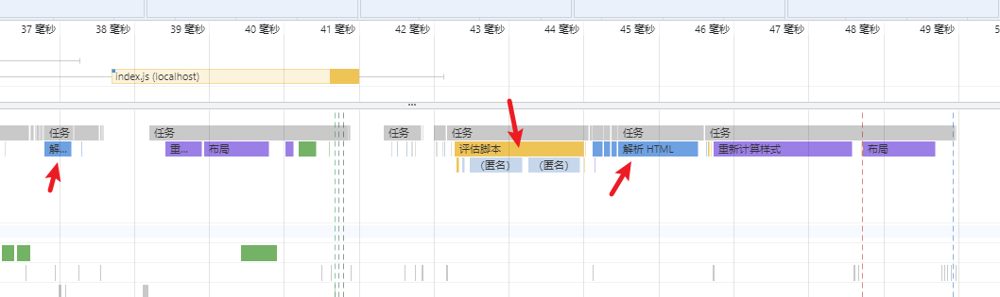
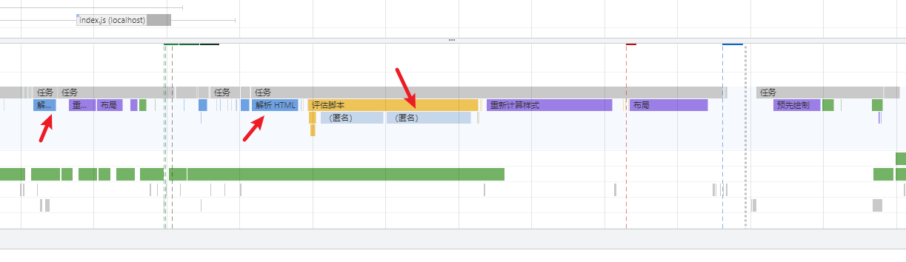
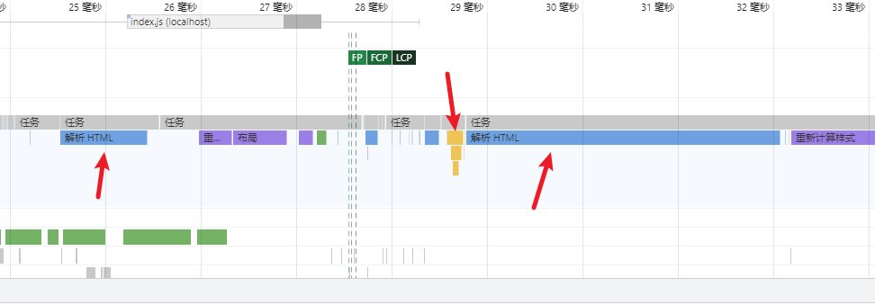

# 模块化

## 为什么需要模块化

也就是常规方式引入 js 有啥问题？

1. 加载时阻塞页面渲染，引入 JS 越多，阻塞时间越长。
2. 容易污染全局变量。
3. js 文件有依赖关系，加载一定要有序。当项目很大时，Dependence 可能会很复杂。
4. 引入 JS 文档太多，不美观，而且不好管理



## 脚本的无阻塞加载

moduleA.js 代码

```js
console.log("I'm A")
/*
此处可以放jquery源码
使得该文件变大，以便异步加载时看效果
*/
```

moduleB.js 代码

```js
console.log("I'm B")
```

同步加载

```js
<body>
  <script src="moduleA.js" onload="console.log('A loaded')"></script>
  <script src="moduleB.js" onload="console.log('B loaded')"></script>
</body>
```

输出

```js
I'm A
A loaded
I'm B
A loaded
```

### defer 和 async

`defer`：在文档完成解析后，触发 DOMContentLoaded 事件前执行。如果缺少 src 属性（即内嵌脚本），该属性不应被使用，因为这种情况下它不起作用。对动态嵌入的脚本使用 `async=false` 来达到类似的效果。

`async`：是否在允许的情况下异步执行该脚本。该属性对于内联脚本无作用 (即没有 src 属性的脚本）。

#### defer 示例

```html
<body>
  <script defer src="moduleA.js" onload="console.log('A loaded')"></script>
  <script src="moduleB.js" onload="console.log('B loaded')"></script>
</body>
```

输出

```js
I'm B
B loaded
I'm A
A loaded
```



#### async 示例

异步加载

```js
<body>
    <script>
        loadScript("moduleA.js", "async A loaded");
        loadScript("moduleB.js", "async B loaded");

        function loadScript(url, text) {
            var srcEle = document.createElement("script");
            srcEle.src = url;
            srcEle.async = true;
            srcEle.onload = function () {
                console.log(text);
            };
            document.body.appendChild(srcEle);
        }
    </script>
</body>
```

> 动态创建的 script 标签，async 默认为 true;

输出

```js
I'm B
async B loaded
I'm A
async A loaded
```



如果要解析的html很多，由于async下载结束之后立刻执行，那么也会阻塞

对于模块脚本，那么脚本及其所有依赖都会在延缓队列中执行，因此它们会被并行请求，并尽快解析和执行,表现与defer类似

相同之处：

- 加载文件时不阻塞页面渲染
- 使用这两个属性的脚本中不能调用 document.write 方法
- 有脚本的 onload 的事件回调

不同之处

- 每一个 async 属性的脚本都在它下载结束之后立刻执行，同时会在 window 的 load 事件之前执行。所以就有可能出现脚本执行顺序被打乱的情况；
- 每一个 defer 属性的脚本都是在页面解析完毕之后，按照原本的顺序执行，同时会在 document 的 DOMContentLoaded 之前执行

## CommonJS

主要是 **Node.js** 使用，通过 `require` **同步**加载模块，`exports` 导出内容。在 CommonJS 规范下，每一个 JS 文件都是独立的模块，每个模块都有独立的作用域，模块里的本地变量都是私有的

首次加载会缓存结果，后续加载则是直接读取缓存结果

缺点

- 同步的加载方式不适用于浏览器端
- 浏览器端使用需要打包
- 难以支持模块静态分析

## AMD

RequireJS 的标准

用来解决浏览器端模块加载的问题。AMD 主要是**浏览器端**使用，通过 `define` 定义模块和依赖，`require` **异步**加载模块，推崇**依赖前置**

通过异步的方式加载模块，每加载一个模块实际就是加载对应的 JS 文件

特点：依赖前置、预执行

```js
define(['./a', './b'], function(a, b) {
  //运行至此，a.js和b.js已经下载完成
  //a模块和b模块已经执行完
  a.doing()
  b.doing()
})

require(['a'], function(a) {})
```

### 简易实现

```javascript
var MyModules = (function Manager() {
  // 保存模块
  var modules = {}
  // 方法名，依赖名，方法
  function define(name, deps, impl) {
    // 解析得到该模块的依赖
    for (var i = 0; i < deps.length; i++) {
      deps[i] = modules[deps[i]]
    }
    // 得到该模块中的方法
    modules[name] = impl.apply(impl, deps)
  }
  // 获取方法
  function get(name) {
    return modules[name]
  }
  return {
    define: define,
    get: get,
  }
})()

// example
MyModules.define('bar', [], function() {
  function hello(who) {
    return 'Let me introduce: ' + who
  }

  return {
    hello: hello,
  }
})

// 定义一个foo方法，foo方法会调用模块中之前定义的bar方法
MyModules.define('foo', ['bar'], function(bar) {
  var hungry = 'hippo'

  function awesome() {
    console.log(bar.hello(hungry).toUpperCase())
  }

  return {
    awesome: awesome,
  }
})

var bar = MyModules.get('bar')
var foo = MyModules.get('foo')

console.log(bar.hello('hippo')) //Let me introduce: hippo

foo.awesome() //LET ME INTRODUCE: HIPPO
```

缺点

- 语法相对复杂
- 依赖加载器
- 难以支持模块静态分析

## CMD

SeaJS 的标准

用来解决浏览器端模块加载的问题。CMD 主要是**浏览器端**使用，通过 `define` 定义模块和依赖，`require` **异步**加载模块，推崇**依赖就近**

过异步的方式加载模块，每加载一个模块实际就是加载对应的 JS 文件

特点：依赖就近、懒执行

```js
define(function(require, exports, module) {
  var a = require('./a')
  //等待a.js下载、执行完
  a.doing()
  var b = require('./b')
  //等待b.js下载、执行完
  b.doing()
})
```

缺点

- 语法相对复杂
- 依赖加载器
- 难以支持模块静态分析

## UMD

UMD 主要为了解决 CommonJS 和 AMD 规范下的代码不通用的问题，同时还支持将模块挂载到全局，是**跨平台**的解决方案

可同时在服务器端和浏览器端使用

UMD 加载模块的方式取决于所处的环境，Node.js 同步加载，浏览器端异步加载。

```javascript
;((root, factory) => {
  if (typeof define === 'function' && define.amd) {
    //AMD
    define(['jquery'], factory)
  } else if (typeof exports === 'object') {
    //CommonJS
    var $ = requie('jquery')
    module.exports = factory($)
  } else {
    root.testModule = factory(root.jQuery)
  }
})(this, $ => {
  //todo
})
```

缺点

- 代码量大

## ESM

官方模块化规范，**现代浏览器原生支持**，通过 `import` 加载模块，`export` 导出内容

在支持的浏览器环境下可以直接使用，在不支持的端需要编译/打包后使用

ESM 加载模块的方式同样取决于所处的环境，Node.js 同步加载，浏览器端异步加载。

默认 defer

### 默认是异步的


模块脚本默认是延迟的。因此，无需添加defer到您的`<script type="module">`标签！不仅主模块的下载与 HTML 解析并行发生，所有依赖模块也是如此！

### export

用于从模块中导出实时绑定的函数、对象或原始值，以便其他脚本可以通过 import 语句使用它们

#### 默认导出

每个模块包含一个

```javascript
let a = 1
export default a
export default b = 2
export default function() {}
export default function name1() {}
export { c as default }

// import a from "./demo.js";
// console.log(a); // 1
```

#### 命名导出

```javascript
let a = 1
let b = 2
export { a, b }
export let c = 3
export function fn() {
  return 4
}

// import {a,b,c,fn as d} from "./demo.js";
// console.log(a,b,c,d()); // 1 2 3 4
```

### import

用于导入由另一个模块导出的绑定。无论是否声明了 strict mode ，导入的模块都运行在严格模式下

- 在 HTML 中需要包含 `type="module"` 的 `<script>` 元素才能正确识别模块
- 不能通过 file:// URL 引用 JS 模块，否则将导致 CORS 错误

#### import()

合适需要动态导入

- 当静态导入的模块很明显的降低了代码的加载速度且被使用的可能性很低，或者并不需要马上使用它。
- 当静态导入的模块很明显的占用了大量系统内存且被使用的可能性很低。
- 需要异步获取的模块
- 当导入模块的说明符，需要动态构建。（静态导入只能使用静态说明符）
- 当被导入的模块有副作用（这里说的副作用，可以理解为模块中会直接运行的代码），这些副作用只有在触发了某些条件才被需要时。（原则上来说，模块不能有副作用，但是很多时候，你无法控制你所依赖的模块的内容）

```javascript
import('./demo.js').then(({ a, b, c, fn }) => {
  console.log(a, b, c, fn()) // 1 2 3 4
})
```

await 用法

```javascript
// 注：await需要在async方法中才能使用
const { a, b, c, fn } = await import('./demo.js')
console.log(a, b, c, fn())
```

## 静态分析

在运行代码之前就可判断出代码内有哪些代码使用到了，哪些没有使用到

## Tree shaking

依赖于 ES2015 中的 [import](https://developer.mozilla.org/zh-CN/docs/Web/JavaScript/Reference/Statements/import) 和 [export](https://developer.mozilla.org/zh-CN/docs/Web/JavaScript/Reference/Statements/export) 语句，用来检测代码模块是否被导出、导入，且被 JavaScript 文件使用

在现代 JavaScript 应用程序中，我们使用模块打包(如[webpack](https://webpack.js.org/)或[Rollup](https://github.com/rollup/rollup))将多个 JavaScript 文件打包为单个文件时自动删除未引用的代码。这对于准备预备发布代码的工作非常重要，这样可以使最终文件具有简洁的结构和最小化大小

main.js

```js
import { getA, getB } from './util'
console.log(getA, getB)
```

util.js

```js
export const getA = () => genA()
export const genA = () => 'a'
export const getB = () => genB()
function genB() {
  return 'b'
}
export const getC = () => 'c'
function genC() {
  return 'c'
}
```

执行`rollup main.js --format iife --file bundle.js`

bundle.js

```js
(function () {
  'use strict';

  const getA = () => genA();
  const genA = () => 'a';
  const getB = () => genB();
  function genB() {
    return 'b'
  }

  console.log(getA, getB);

})();
```

不是esmodule, 无法分析哪些方法被使用，因为库一般作为一个全局变量引入，rollup打包可能有已下警告：

`Use output.globals to specify browser global variable names corresponding to external modules`
