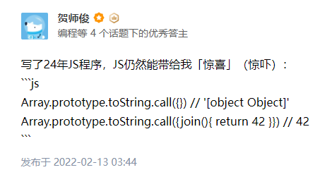
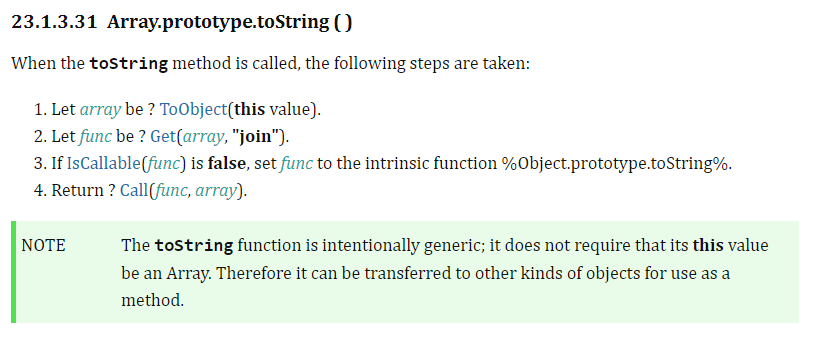

# 【难以理解的js】Array.prototype.toString

## 问题来源



<https://www.zhihu.com/pin/1476038860152602624>

为何`Array.prototype.toString.call({join(){ return 42 }})`返回`42`，不应该也是`[object Object]`吗？？？

## 探究

首先有两点我们比较容易理解：

- 数组的`toString()`实际调用了`join()`
  - `[2, 3, 4].toString() == '2,3,4'`
  - `[2, 3, 4].join() === '2,3,4'`
  - 可以通过修改原型上的`join`方法，再调`toString`验证

- `Array`的原型上实现了自己的`toString`方法，所以不会到`Object`的原型上去找`toString`

那么问题肯定就出在`Array`的原型上`toString`方法的实现

借助两大法宝：

**ecma的规范**:



<https://tc39.es/ecma262/#sec-array.prototype.tostring>

**v8的实现**：

```c++
// https://tc39.github.io/ecma262/#sec-array.prototype.tostring
transitioning javascript builtin ArrayPrototypeToString(
    js-implicit context: NativeContext, receiver: JSAny)(...arguments): JSAny {
  // 1. Let array be ? ToObject(this value).
  const array: JSReceiver = ToObject_Inline(context, receiver);

  // 2. Let func be ? Get(array, "join").
  const prop: JSAny = GetProperty(array, 'join');
  try {
    // 3. If IsCallable(func) is false, let func be the intrinsic function
    //    %ObjProto_toString%.
    const func: Callable = Cast<Callable>(prop) otherwise NotCallable;

    // 4. Return ? Call(func, array).
    return Call(context, func, array);
  } label NotCallable {
    return ObjectToString(context, array);
  }
}
```

## 解析

借助规范和代码，可以得到`toString`的实现逻辑：

1. 把`toString()`的参数转化为对象，例子中`{join(){ return 42 }}`就是一个对象，这一步得到的`array`就是`{join(){ return 42 }}`
2. 获取`join`属性
3. 把`join`转为方法
4. `join`能转为方法，就调用这个方法并返回，`join`不能转为方法，就调用`Object.prototype.toString`返回

至此真相大白，关键就在于获取了`join`

联系到前面说的：数组的`toString()`实际调用了`join()`，也就理解`toString`为何这么设计了

> 把`toString()`的参数转化为对象，也有转换逻辑，这里不做讨论

## 总结

- 很显然，这不是bug；规范设计也是合理的

- 判断类型应该用`Object.prototype.toString`