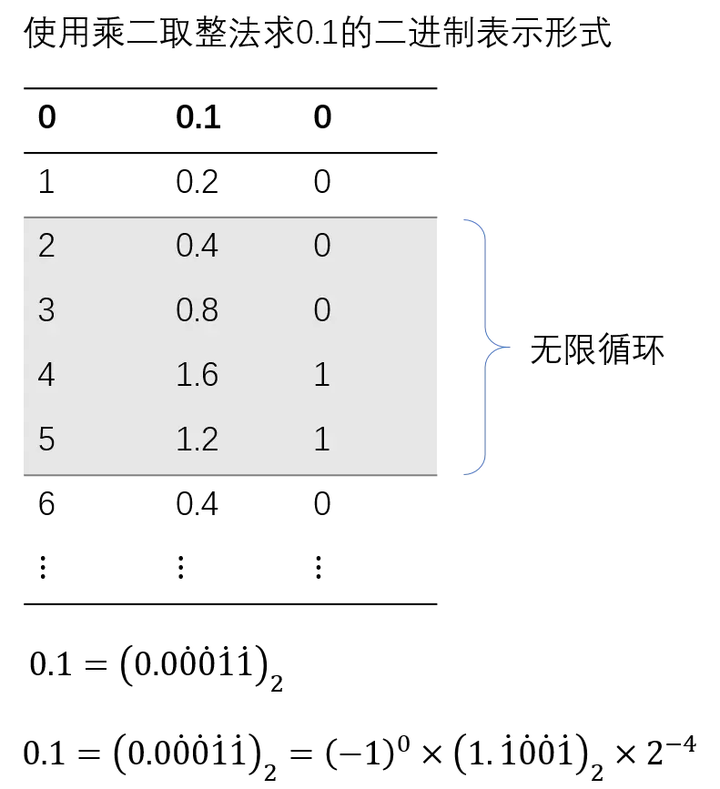

# sh

## 类型

- 零舍一入
- 除零取整法
- 乘零取整法

## ieee 7

$$
\begin{aligned}
& 12.34 = 1 \times 10^1 + 2 \times 10^0 + 3 \times 10^{-1} + 4 \times 10^{-2} \\
& 7.75 = 4 + 2 + 1 + 1 / 2 + 1 / 4 = 1 \times 2^2 + 1 \times 2^1 + 1 \times 2^0 + 1 \times 2^{-1} + 1 \times 2^{-2} = 111.11_2
\end{aligned}
$$

- 对于十进制，小数点的左移右移相当于乘以10或除以10
- 对于二进制，小数点的左移右移相当于乘以2或除以2

科学计数法

- 节省内存空间
- 直观的确定大小

---

二进制科学计数法

$$ {aligned}
\alpha \times 2^n
$$

- 指数基数为2
- $\mid a \mid >= 1 且 \mid a \mid < 2$
- n为整数

$$
7.75 = 111.11_2 = 1.1111 \times 2^2
$$

### IEEE 754定义

<https://zh.wikipedia.org/zh-hans/IEEE_754>


- sign：0表示正数，1表示负数
- exponent： 指数值加上一个偏移值，偏移值为：$2^{n-1}-1$，其中的n为**存储指数**的比特位长度
- fraction：小数部分（最高位1规定不显示存储）

32位单精度

- 1位符号位，8位指数位，23位小数位；偏移值127
- $n=(-1)^{sign} \times (1+小数) \times 2^{指数-127}$

#### 举例

$$
\begin{align}
78 &= 1 \times 2^6 +  0 \times 2^5 + 0 \times 2^4 + 1 \times 2^3 + 1 \times 2^2 +  1 \times 2^1 +  0 \times 2^0 \\
&= 1001110_2 \\
&= 1.001110_2 \times 2^6
\end{align}
$$ {align}

- sign为0，exponent为6+127=133=$10000101_2$，fraction为001110

- 0-10000101-00111000000000000000000

$$
-16 = -10000_2 = -1.0000 \times 2^4
$$

- sign为1，exponent为$4+127=131=10000011_2$，fraction为0000

- 1-10000011-00000000000000000000000

$$
7.75 = 111.11_2 = 1.1111 \times 2^2
$$

- sign为0，exponent为$2+127=129=10000001_2$，fraction为0000

- 0-10000001-11110000000000000000000

### 还原

#### 0.1+0.2



$0.1 = (0.0\dot0\dot0\dot1\dot1)_2=(-1)^0\times2^{-4}\times(1.\dot1\dot0\dot0\dot1)_2$

- sign为0，exponent为$-4+127=123=01111011_2$，fraction为0000

- 0-01111011-10011001100110011001101

$0.2 = 0.1\times2^1=(-1)^0\times2^{-3}\times(1.\dot1\dot0\dot0\dot1)_2$

- sign为0，exponent为$-3+127=124= 01111100_2$，fraction为0000

- 0-01111100-10011001100110011001101

先进行“对位”，将较小的指数化为较大的指数，并将小数部分相应右移
$$
\begin{align}
0.1 &= (-1)^0\times2^{-3}\times(0.1100 1100 1100 1100 1100 110)_2 \\
0.2 &= (-1)^0\times2^{-3}\times(1.1001 1001 1001 1001 1001 101)_2 \\
0.1 + 0.2 &=(-1)^0\times2^{-3}\times(10.0110 0110 0110 0110 0110 011)_2 \\
&= (-1)^0\times2^{-2}\times(1.0011 0011 0011 0011 0011 010)_2 \\
\end{align}
$$

```js
// 0.3
      // 0.010011001100110011001100110011001100110011001100110011
      // 0.0100110011001100110011001100110011001100110011001101
      const str = '0.0100110011001100110011001100110011001100110011001101',
        len = str.length
      let e = 0,
        expression = ''
      for (let i = 0; i < len; i++) {
        const element = str[i]
        if (element === '.') {
          continue
        }
        expression += element + ' * 2 ** ' + e-- + (i === len - 1 ? '' : ' + ')
      }
      console.log(expression)
      console.log(eval(expression))
```


### reference

<https://segmentfault.com/a/1190000008268668>

<https://babbage.cs.qc.cuny.edu/IEEE-754/>

<https://devtool.tech/double-type>
