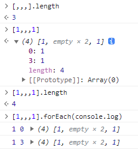

# 小技巧

解除禁止粘贴

```javascript
var allowPaste = function(e){
  e.stopImmediatePropagation();
  return true;
};
document.addEventListener('paste', allowPaste, true);
```

0 && console.log(1) 返回0

1 > 0 && console.log(1) 打印1, 返回0

## 检测控制台是否打开

<https://www.v2ex.com/t/967742#reply26>

<https://github.com/AEPKILL/devtools-detector>
<https://github.com/theajack/disable-devtool>

- 禁用数据表右键, 快捷键禁用F12
- 检测窗口大小
- console.table 打印大的对象数据

```js
function createLargeObject() {
  const largeObject = {}
  for (let i = 0; i < 500; i++) {
    largeObject[`${i}`] = `${i}`
  }
  return largeObject
}
function createLargeObjectArray() {
  const largeObject = createLargeObject()
  const largeObjectArray = []
  for (let i = 0; i < 50; i++) {
    largeObjectArray.push(largeObject)
  }
  return largeObjectArray
}
const obj = createLargeObjectArray()
function now() {
  return new Date().getTime()
}
function calculateTime(func) {
  const start = now()
  func()
  return now() - start
}
console.log(
  calculateTime(() => {
    console.table(obj)
  })
)
```

打开和没打开控制台 耗时不一样

## URLSearchParams

URLSearchParams chrome 有些版本不支持

99 101~104 107 不支持
115 支持，好像最近才支持？

<https://bugs.chromium.org/p/chromium/issues/detail?id=1341570&q=URLSearchParams&can=2>

<https://stackoverflow.com/questions/74545334/urlsearchparams-not-updating-the-url>

## console.log

1. console.log 打印的是引用，有“延迟”效果
2. 要“看”值时，才实际求值
3. 求过值，不会再次求值
4. 不展开、没有f12打开控制台，就不会求值

``` javascript
const obj = {}
console.log(obj)
setTimeout(() => {
  Object.defineProperty(obj, 'a', {
    get() {
      return new Date()
    },
  })
}, 2000)
```

substring

```js
location.href.substring(location.href.indexOf('?'))
```

indexOf 返回-1时，substring返回值往往不符合预期

## Trailing commas



## Comma Operator

- 作用域
<https://developer.mozilla.org/en-US/docs/Web/JavaScript/Reference/Operators/Comma_Operator>
<https://stackoverflow.com/questions/40967162/what-is-the-meaning-of-0-somefunction-in-javascript>

## importmap

<https://developer.mozilla.org/zh-CN/docs/Web/HTML/Element/script/type/importmap>
一般 from后面是个路径

```
import dayjs from 'https://cdn.skypack.dev/dayjs@1.10.7'
```

加个映射

```
<script type="importmap">
      {
        "imports": {
          "dayjs": "https://cdn.skypack.dev/dayjs@1.10.7",
          "myapp": "/static/js/myapp.js"
        }
      }
</script>
```

就可以

```
import dayjs from 'dayjs'
```

> 在JavaScript中，使用import导入的变量是只读的，不能修改其值，但可以修改其属性或元素的值
