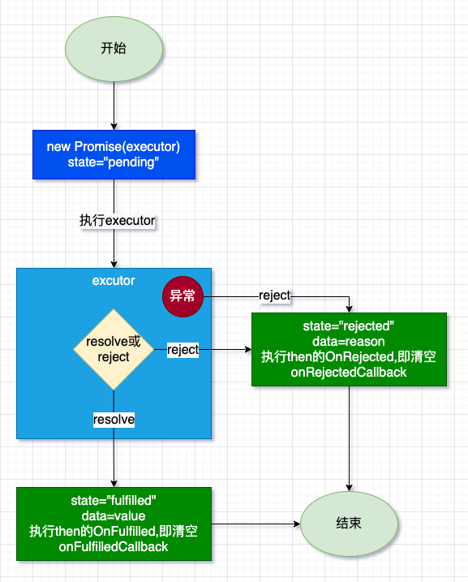
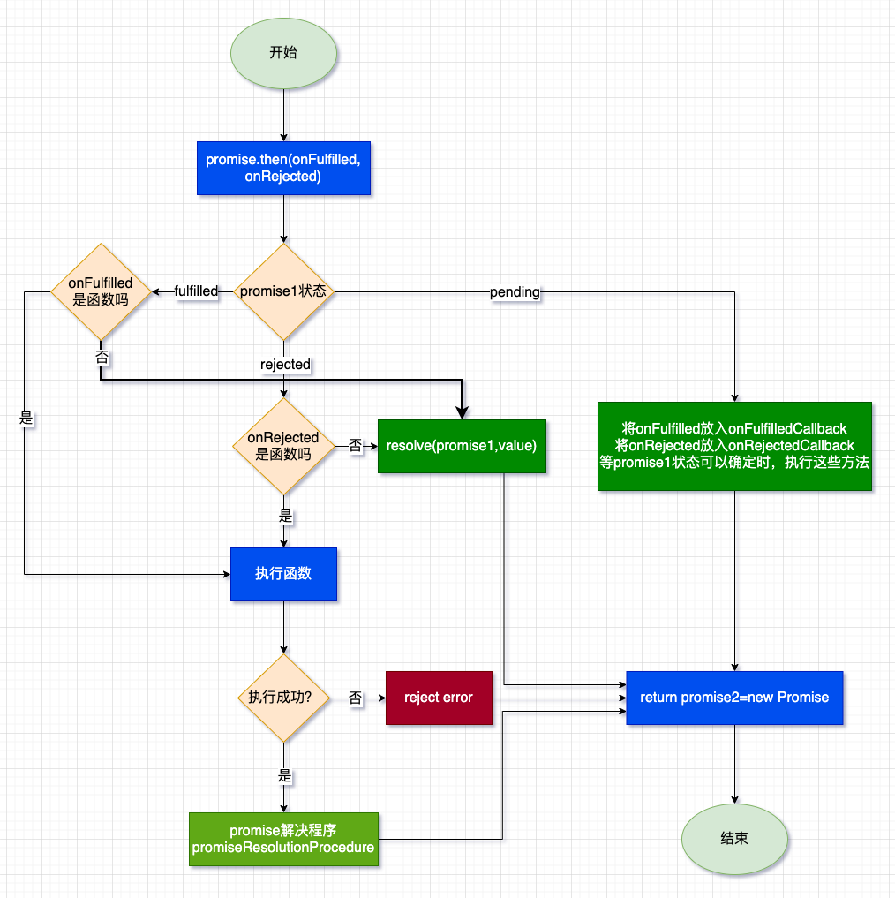
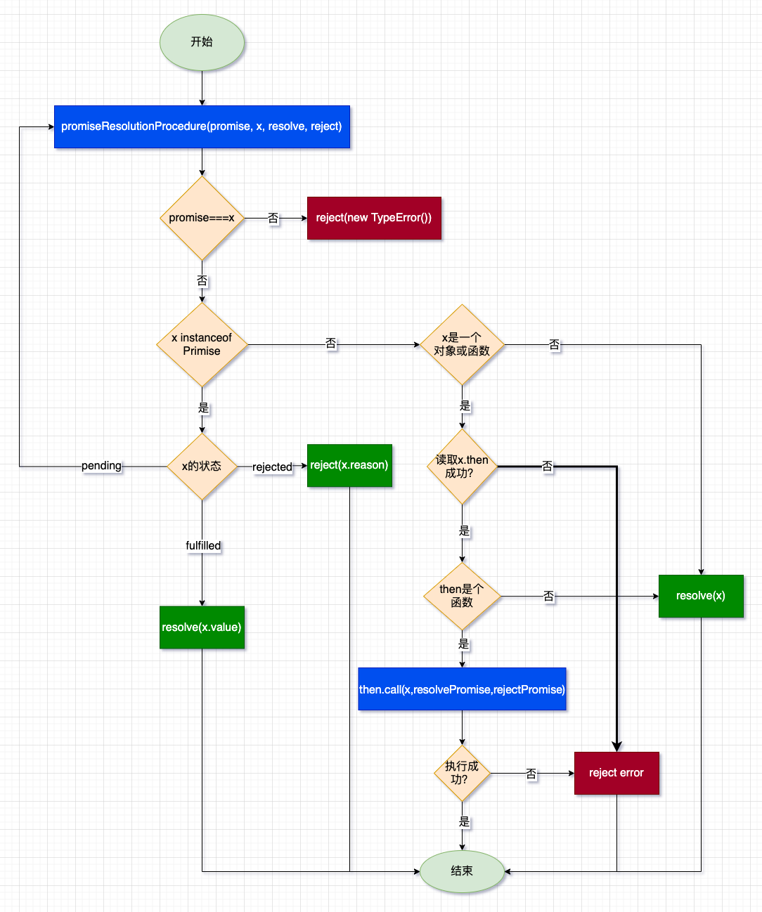

# Promise

给你一个承诺，未来一定有结果

实现一个符合 Promises/A+ 规范的 Promise

<https://promisesaplus.com/>

## 设计思想

- 需要做的事儿交给 promise

  - promise 提供 resolve，reject，用这两个函数告诉 promise 事情的结果

- 做完后干什么交给 promise.then

## 规范解读

### Promise 构造函数

Promise 必须处于以下三种状态之一：

#### pending

- 当处于 pending 状态时，可以转换到 fulfilled 或 rejected 状态

#### fulfilled

- 当处于 fulfilled 状态时，不可以转换到其它任何状态

- 必须有一个不能改变的值

#### rejected

- 当处于 rejected 状态时，不可以转换到其它任何状态
- 必须有一个不能改变的理由

#### 流程图



### then

promise 必须提供一个`then`方法来访问其完成的值或拒绝的原因。

一个 promise 的`then`方法接受两个参数：

```javascript
promise.then(onFulfilled, onRejected)
```

- 可选的参数：

  1. 如果`onFulfilled`不是函数，则必须忽略它。

  2. 如果`onRejected`不是函数，则必须忽略它。

- 如果`onFulfilled`是一个函数：

  1. 必须在`promise`完成后调用它，并将`promise`的值作为它的第一个参数。

  2. 在`promise`完成之前不能调用它。

  3. 它不能被多次调用。

- 如果`onRejected`是函数，

  1. 必须在`promise`被拒绝后调用它，以拒绝原因作为它的第一个参数。

  2. 在`promise`被拒绝之前不能调用它。

  3. 它不能被多次调用。

- `onFulfilled`或者`onRejected`在执行上下文堆栈仅包含平台代码之前不得调用。【注 1】

- `onFulfilled`并且`onRejected`必须作为函数调用（即没有`this`值）。【注 2】

- `then`可以在同一个 promise 上多次调用。

  1. 如果`promise`完成，则所有相应的`onFulfilled`回调必须按照它们对的原始调用的顺序执行`then`。

  2. 如果`promise`被拒绝，则所有相应的`onRejected`回调必须按照它们对的原始调用的顺序执行`then`。

- `then`必须返回一个承诺 。【注 3】

  1. 如果`onFulfilled`或`onRejected`返回值`x`，则运行承诺解析程序`[[Resolve]](promise2, x)`。

  2. 如果任一`onFulfilled`或`onRejected`抛出一个异常`e`，`promise2`必须被拒绝`e`的原因。
  3. 如果`onFulfilled`不是函数并且`promise1`被满足，则`promise2`必须用与相同的值来满足`promise1`。
  4. 如果`onRejected`不是函数并被`promise1`拒绝，则`promise2`必须以与相同的原因被拒绝`promise1`

  ```javascript
  promise2 = promise1.then(onFulfilled, onRejected)
  ```

#### 流程图



### Promise 解决程序

then 中 onFulfilled 或 onRejected 的返回值 x，可能是 promise,可能是个 thenable,也可能是其他东西，就需要 Promise 解决程序来处理具体情况，假设 Promise 解决程序它叫`promiseResolutionProcedure`

- `thenable`是含有 then 方法的对象或函数

```javascript
function promiseResolutionProcedure(promise, x, resolve, reject)
```

`promiseResolutionProcedure`，满足下面步骤：

- 如果`promise`和`x`引用同一个对象，`promise`则以 `TypeError`为理由拒绝。

- 如果`x`是 promise，则采用其状态 ：【注 4】

  1. 如果`x`处于挂起状态，则`promise`必须保持挂起状态，直到`x`完成或被拒绝。

  2. 如果`x`处于完成状态，`promise`以相同的值完成。

  3. 如果`x`处于被拒绝状态，`promise`以同样的理由拒绝。

- 如果`x`是一个对象或函数，

  1. 取`then`为`x.then`。【注 5】

  2. 如果检索属性`x.then`时抛出的异常`e`，则`promise`用`e`作为拒绝原因拒绝。

  3. 如果`then`是一个函数，那么用 x 调用它，第一个参数为`resolvePromise`，第二个参数为`rejectPromise`，即：`then.call(x,resolvePromise,rejectPromise)`,其中：

     1. 假设 `resolvePromise` 使用一个名为 y 的值来调用，则运行`promiseResolutionProcedure(promise2, y, resolve, reject)`

     2. 假设 `rejectPromise` 使用一个名为 `r` 的 拒绝原因 来调用，则用`r`作为拒绝原因拒绝

     3. 如果同时调用`resolvePromise`和`rejectPromise`，或者多次调用同一个参数，则第一个调用优先，之后的调用都将被忽略。
     4. 如果调用`then`抛出异常`e`
        1. 如果`resolvePromise`或`rejectPromise`已被调用，则忽略它。
        2. 否则，则`promise`用`e`作为拒绝原因拒绝。

  4. 如果`then`不是一个函数，则`promise`用`x`作为最终值完成。

- 如果`x`不是一个对象或函数，则`promise`用`x`作为最终值完成。

如果一个 promise 链式调用了多次 then，promiseResolutionProcedure 的递归的性质可能会再次调用 promiseResolutionProcedure，导致无限递归。鼓励（但不是必需）实现检测这种递归，并以信息性的 TypeError 作为拒绝承诺的原因。【注 6】

#### 流程图



### 注解

1. 这里的“平台代码”是指引擎、环境和 promise 实现代码。在实践中，这个要求确保`onFulfilled`和`onRejected`异步执行，在`then`调用事件循环之后，并使用新的堆栈。这可以通过“宏任务”机制（例如[`setTimeout`](https://html.spec.whatwg.org/multipage/webappapis.html#timers)或[`setImmediate`](https://dvcs.w3.org/hg/webperf/raw-file/tip/specs/setImmediate/Overview.html#processingmodel)）或“微任务”机制（例如[`MutationObserver`](https://dom.spec.whatwg.org/#interface-mutationobserver)或 ）来实现[`process.nextTick`](https://nodejs.org/api/process.html#process_process_nexttick_callback)。由于 promise 实现被认为是平台代码，它本身可能包含一个任务调度队列或“trampoline”，在其中调用处理程序。
2. 也就是说，在严格模式下`this`会是`undefined`；在非严格模式下，它将是全局对象。
3. 实现可以允许`promise2 === promise1`，只要实现满足所有要求。每个实现都应该记录它是否可以产生`promise2 === promise1`以及在什么条件下产生。
4. 一般来说，只有`x`当它来自当前的实现时，才会知道这是一个真正的承诺。该条款允许使用特定于实现的手段来采用已知符合承诺的状态。
5. 这个首先存储对 的引用`x.then`，然后测试该引用，然后调用该引用的过程避免了对该`x.then`属性的多次访问。这些预防措施对于确保访问器属性的一致性很重要，访问器属性的值可能会在检索之间发生变化。
6. 实现应*不*设置 thenable 链的深度任何限制，并假设超出任何限制递归将是无限的。只有真正的循环才会导致`TypeError`; 如果遇到无限的不同 thenable 链，则永远递归是正确的行为

## 实现

### Promise

```javascript
// executor:用户需要promise做的操作
function Promise(executor) {
  // 存储状态
  this.state = 'pending'
  // promise完成时，需要执行的回调集合
  this.onFulfilledCallback = []
  // promise被拒绝时，需要执行的回调集合
  this.onRejectedCallback = []

  const self = this

  // 完成后，需要通过resolve通知promise
  function resolve(value) {
    setTimeout(function() {
      if (self.state === 'pending') {
        self.state = 'fulfilled'
        // 完成时必须有一个值
        self.data = value
        // 执行then注册的完成后的回调
        for (let i = 0; i < self.onFulfilledCallback.length; i++) {
          self.onFulfilledCallback[i](value)
        }
      }
    })
  }

  // 被拒绝后，需要通过reject通知promise
  function reject(reason) {
    setTimeout(function() {
      if (self.state === 'pending') {
        self.state = 'rejected'
        // 被拒绝时，必须有一个原因
        self.data = reason
        // 执行then注册的被拒绝后的回调
        for (let i = 0; i < self.onRejectedCallback.length; i++) {
          self.onRejectedCallback[i](reason)
        }
      }
    })
  }

  try {
    // 执行用户需要做的操作
    executor(resolve, reject)
  } catch (reason) {
    reject(reason)
  }
}
```

### Promise.prototype.then

```javascript
// onFulfilled：完成后需要做的事儿
// onRejected：被拒绝后需要做的事儿
Promise.prototype.then = function(onFulfilled, onRejected) {
  const self = this

  let promise2 = new Promise(function(resolve, reject) {
    if (self.state === 'fulfilled') {
      // 状态是已完成
      setTimeout(function() {
        if (typeof onFulfilled === 'function') {
          // onFulfilled是函数
          try {
            // 传promise完成的值
            const x = onFulfilled(self.data)
            // 返回值x交给promise解决程序处理
            promiseResolutionProcedure(promise2, x, resolve, reject)
          } catch (e) {
            // 异常e作为拒绝原因
            reject(e)
          }
        } else {
          // onFulfilled不是函数
          // 传promise完成的值
          resolve(self.data)
        }
      })
    } else if (self.state === 'rejected') {
      // 状态是已拒绝
      setTimeout(function() {
        if (typeof onRejected === 'function') {
          // onRejected是函数
          try {
            // 传promise拒绝的原因
            const x = onRejected(self.data)
            // 返回值x交给promise解决程序处理
            promiseResolutionProcedure(promise2, x, resolve, reject)
          } catch (e) {
            // 异常e作为拒绝原因
            reject(e)
          }
        } else {
          // onRejected不是函数
          // 传promise拒绝的原因
          reject(self.data)
        }
      })
    } else if (self.state === 'pending') {
      // promise还处于挂起状态，悬而未决
      // then可能被promise多次调用，那么onFulfilled或onRejected就应该放入各自callback队列中，等到真正完成或被拒绝时，callback中的函数会被依次执行
      // 1.把onFulfilled放入onFulfilledCallback
      self.onFulfilledCallback.push(function(promise1Value) {
        if (typeof onFulfilled === 'function') {
          try {
            const x = onFulfilled(self.data)
            promiseResolutionProcedure(promise2, x, resolve, reject)
          } catch (e) {
            reject(e)
          }
        } else {
          resolve(promise1Value)
        }
      })
      // 2.把onRejected放入onRejectedCallback
      self.onRejectedCallback.push(function(promise1Reason) {
        if (typeof onRejected === 'function') {
          try {
            const x = onRejected(self.data)
            promiseResolutionProcedure(promise2, x, resolve, reject)
          } catch (e) {
            reject(e)
          }
        } else {
          reject(promise1Reason)
        }
      })
    }
  })
  return promise2
}
```

### promiseResolutionProcedure

```javascript
// promise:当前的promose
// x:then中onFulfilled或onRejected的返回值
// resolve:promise中的resolve
// reject:promise中的reject
function promiseResolutionProcedure(promise, x, resolve, reject) {
  // 如果 promise 和 x 引用的是同一个对象，promise 将以一个 TypeError 作为拒绝原因拒绝。
  if (promise === x) {
    return reject(new TypeError('Chaining cycle detected for promise'))
  }

  if (x instanceof Promise) {
    // 如果 x 是一个 promise
    if (x.state === 'pending') {
      // 如果 x 的状态为 pending，promise 必须保持 pending 状态直到 x 的状态变为 fulfilled 或 rejected
      x.then(function(value) {
        promiseResolutionProcedure(promise, value, resolve, reject)
      }, reject)
    } else if (x.state === 'fulfilled') {
      // 如果 x 的状态为 已完成 promise 也用同样的值来执行 fulfill 操作
      resolve(x.data)
    } else if (x.state === 'rejected') {
      // 如果 x 的状态为 rejected，那么 promise 也用同样的 reason 来执行 reject 操作
      reject(x.data)
    }
    return
  }

  if (x && (typeof x === 'object' || typeof x === 'function')) {
    // x 是一个对象或者函数
    // 标记resolvePromise和rejectPromise是否被调用过
    let isCalled = false

    try {
      // 取then为x.then
      let then = x.then
      if (typeof then === 'function') {
        // 如果then是一个函数，那么用x调用它，第一个参数为resolvePromise，第二个参数为rejectPromise
        then.call(
          x,
          function resolvePromise(y) {
            // 如果同时调用`resolvePromise`和`rejectPromise`，或者多次调用同一个参数，则第一个调用优先，之后的调用都将被忽略
            if (isCalled) return
            isCalled = true
            // 假设 resolvePromise 使用一个名为 y 的值来调用，则运行promiseResolutionProcedure(promise, y, resolve, reject)
            return promiseResolutionProcedure(promise, y, resolve, reject)
          },
          function rejectPromise(r) {
            // 如果同时调用`resolvePromise`和`rejectPromise`，或者多次调用同一个参数，则第一个调用优先，之后的调用都将被忽略
            if (isCalled) return
            isCalled = true
            // 假设 rejectPromise 使用一个名为 r 的 拒绝原因 来调用，则用r作为拒绝原因拒绝
            return reject(r)
          }
        )
      } else {
        // 如果 then 不是一个函数，则promise用x作为值完成
        resolve(x)
      }
    } catch (e) {
      // 如果 resolvePromise 或 rejectPromise 已经被调用过了，则忽略异常。
      if (isCalled) return
      isCalled = true
      // 否则，则promise用e作为拒绝原因拒绝。
      reject(e)
    }
  } else {
    // 如果x不是一个对象或函数，则promise用x作为值完成
    resolve(x)
  }
}
```

## thenable

thenable 理解

```javascript
let p1 = new Promise(function(resolve, reject) {
  setTimeout(function() {
    resolve('p 2000')
  }, 2000)
})
p1.then(function(v) {
  console.log('p1.then:', v)
  let p2 = new Promise(function(resolve, reject) {
    setTimeout(function() {
      resolve('p2 2000')
    }, 2000)
  })
  p2.then(function(v) {
    console.log('p2.then:', v)
  })
  return p2
})
  .then(v => {
    //thenable
    let thenable = {
      then: function(onFulfilled, onRejected) {
        setTimeout(function() {
          onFulfilled('thenable 2000')
        }, 2000)
      },
    }
    thenable.then(v => {
      console.log('thenable.then:', v)
    })
    return thenable
  })
  .then(console.log)
```

输出:

```
p1.then: p 2000
p2.then: p2 2000
thenable.then: thenable 2000
thenable 2000
```

## 测试

<https://github.com/promises-aplus/promises-tests>

```javascript
// test.js

// 导入我们写好的 promise
const Promise = require('./promise.js')

// 根据官方文档暴露一个 deferred 方法，返回一个包含 promise、resolve、reject 的对象
Promise.deferred = function() {
  const obj = {}

  obj.promise = new Promise(function(resolve, reject) {
    obj.resolve = resolve
    obj.reject = reject
  })

  return obj
}

module.exports = Promise
```

运行

```shell
npx promises-aplus-tests test.js
```

## 其他方法

```js
//resolve方法
Promise.resolve = function(val) {
  return new Promise((resolve, reject) => {
    resolve(val)
  })
}
//reject方法
Promise.reject = function(val) {
  return new Promise((resolve, reject) => {
    reject(val)
  })
}
//race方法  方法返回一个 promise，一旦迭代器中的某个promise解决或拒绝，返回的 promise就会解决或拒绝
Promise.race = function(promises) {
  return new Promise((resolve, reject) => {
    for (let i = 0; i < promises.length; i++) {
      promises[i].then(resolve, reject)
    }
  })
}
//all方法(获取所有的promise，都执行then，把结果放到数组，一起返回)
Promise.all = function(promises) {
  let arr = []
  let i = 0
  function processData(index, data, resolve) {
    arr[index] = data
    i++
    if (i == promises.length) {
      //debugger;
      resolve(arr)
    }
  }
  return new Promise((resolve, reject) => {
    for (let i = 0; i < promises.length; i++) {
      const promise = promises[i]
      if (promise instanceof Promise) {
        promise.then(data => {
          processData(i, data, resolve)
        }, reject)
      } else {
        processData(i, promise, resolve)
      }
    }
  })
}

//测试
//resolve
Promise.resolve(123).then(function(value) {
  console.log(value)
})

//reject
Promise.reject('Testing static reject').then(
  function(reason) {
    // 未被调用
  },
  function(reason) {
    console.log(reason)
  }
)

Promise.reject(new Error('fail')).then(
  function(result) {
    // 未被调用
  },
  function(error) {
    console.log(error)
  }
)

//race
var promise1 = new Promise(function(resolve, reject) {
  setTimeout(resolve, 500, 'one')
})

var promise2 = new Promise(function(resolve, reject) {
  setTimeout(resolve, 100, 'two')
})

Promise.race([promise1, promise2]).then(function(value) {
  console.log(value)
})

//all
promise1 = Promise.resolve(3)
promise2 = 42
var promise3 = new Promise(function(resolve, reject) {
  setTimeout(resolve, 100, 'foo')
})

Promise.all([promise1, promise2, promise3]).then(function(values) {
  console.log(values)
})
```

## reference

<https://febook.hzfe.org/awesome-interview/book1/coding-promise>
