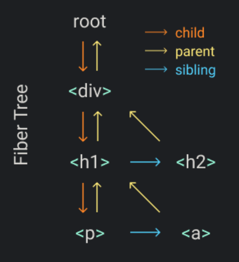

# 深入 React

## requestIdleCallback

## JSX

借 bable 将 jsx 转换为*createElement 函数*
`<script src="https://unpkg.com/@babel/standalone/babel.min.js"></script>`
先看看 bable 将 jsx 转成了什么

```javascript
<script type="text/babel">
  const element = ()=>(
    <div style="background: yellowgreen">
      <h1>Bable</h1>
      <h2 style="text-align:center">Yes</h2>
    </div>
);
console.log(element.toString());
```

打印结果如下：

```javascript
function element() {
  return /*#__PURE__*/ React.createElement(
    'div',
    {
      style: 'background: yellowgreen',
    },
    /*#__PURE__*/ React.createElement('h1', null, 'Bable'),
    /*#__PURE__*/ React.createElement(
      'h2',
      {
        style: 'text-align:center',
      },
      'Yes'
    )
  )
}
```

React.createElement 是我么熟悉的 React 中的方法。
如果能替换 React.createElement，就能自己定义如何从 jsx 生产 dom 节点了。

定义 createElement 函数

```javascript
function createElement(type, props, ...children) {
  return {
    type,
    props: {
      ...props,
      children: children.map(child =>
        typeof child === 'object' ? child : createTextElement(child)
      ),
    },
  }
}

function createTextElement(text) {
  return {
    type: 'TEXT_ELEMENT',
    props: {
      nodeValue: text,
      children: [],
    },
  }
}
```

定义 render 函数

```javascript
function render(element, container) {
  const dom =
    element.type == 'TEXT_ELEMENT'
      ? document.createTextNode('')
      : document.createElement(element.type)
  const isProperty = key => key !== 'children'
  Object.keys(element.props)
    .filter(isProperty)
    .forEach(name => {
      dom[name] = element.props[name]
    })
  element.props.children.forEach(child => render(child, dom))
  container.appendChild(dom)
}
```

如何将 createElement 替换自己实现的呢？
注释标记
`_/** @jsx Veact.createElement */_`

```javascript
const Veact = {
  createElement,
  render,
}

/** @jsx Veact.createElement */
const element = () => (
  <div style="background: yellowgreen">
    <h1>Bable</h1>
    <h2 style="text-align:center">Yes</h2>
  </div>
)
console.log(element.toString())
```

这样解析 element 时，会自动调用 Veact.createElement
打印结果如下

```javascript
function element() {
  return Veact.createElement(
    'div',
    {
      style: 'background: yellowgreen',
    },
    Veact.createElement('h1', null, 'Bable'),
    Veact.createElement(
      'h2',
      {
        style: 'text-align:center',
      },
      'Yes'
    )
  )
}
```

测试：

```javascript
const container = document.getElementById('app')
Veact.render(element, container)
```

## Fiber


什么是 fiber
一种数据结构，为了使查找下一个工作单元变得容易。这就是为什么每个 fiber 都链接到其第一个子节点，下一个兄弟姐妹和父节点

```javascript
Didact.render(
  <div>
    <h1>
      <p />
      <a />
    </h1>
    <h2 />
  </div>,
  container
)
```

为每个元素创建一个 fiber
每个 fiber 就是一个工作单元

在 render 中，我们将创建根 fiber 并将其设置为 nextUnitOfWork。剩下的工作将在 performUnitOfWork 功能上进行，我们将为每个 fiber 做三件事：

1. 将元素添加到 DOM
1. 为元素的子代创建 fiber
1. 选择下一个工作单元

当我们完成对 fiber 的工作时，如果它有一个孩子，那么 fiber 将是下一个工作单元
例如：当我们完成`div fiber`工作时，下一个工作单元将是`h1`fiber

如果 fiber 没有 child，则将 sibling 用作下一个工作单元。

例如，p 光纤没有，child 因此 a 在完成后我们将其移至 fiber
如果 fiber 没有子节点和兄弟节点，我们转到“叔叔”：`sibling`的`parent`。像`a`和`h2`纤维一样的例子

如果`parent`不含 a `sibling`，我们将继续遍历`parent`，直到找到带有 a 的`sibling`或到达根为止。
如果我们已经扎根，则意味着我们已经完成了为此的所有工作`render`

```javascript
<script type="text/babel">
  function createElement(type, props, ...children) {
    return {
      type,
      props: {
        ...props,
        children: children.map(child => (typeof child === 'object' ? child : createTextElement(child))),
      },
    }
  }

  function createTextElement(text) {
    return {
      type: 'TEXT_ELEMENT',
      props: {
        nodeValue: text,
        children: [],
      },
    }
  }

  function createDom(fiber) {
    const dom = fiber.type == 'TEXT_ELEMENT' ? document.createTextNode('') : document.createElement(fiber.type)
    const isProperty = key => key !== 'children'
    Object.keys(fiber.props)
      .filter(isProperty)
      .forEach(name => {
        dom[name] = fiber.props[name]
      })

    return dom
  }

  // 下一个工作单元，即下一个fiber
  let nextUnitOfWork = null
  // 根fiber
  let rootFiber = null

  // 提交根fiber
  function commitRoot() {
    commitWork(rootFiber.child)
    rootFiber = null
  }

  //递归插入节点
  function commitWork(fiber) {
    if (!fiber) {
      return
    }
    const domParent = fiber.parent.dom
    domParent.appendChild(fiber.dom)
    commitWork(fiber.child)
    commitWork(fiber.sibling)
  }

  function render(element, container) {
    rootFiber = {
      dom: container,
      props: {
        children: [element],
      },
    }
    nextUnitOfWork = rootFiber
  }

  function workLoop(deadline) {
    let shouldYield = false
    while (nextUnitOfWork && !shouldYield) {
      nextUnitOfWork = performUnitOfWork(nextUnitOfWork)
      shouldYield = deadline.timeRemaining() < 1
    }

    if (!nextUnitOfWork && rootFiber) {
      commitRoot()
    }

    requestIdleCallback(workLoop)
  }

  requestIdleCallback(workLoop)

  function performUnitOfWork(fiber) {
    // 一. 根据fiber创建dom
    if (!fiber.dom) {
      fiber.dom = createDom(fiber)
    }

    // 避免每处理一个fiber就往dom插入一个，最好等得到所有dom后再插入
    // if (fiber.parent) {
    //   fiber.parent.dom.appendChild(fiber.dom)
    // }

    // 二.为子节点创建fiber
    const elements = fiber.props.children
    let index = 0
    // 记录上一个fiber
    let prevSibling = null

    // 循环子节点
    while (index < elements.length) {
      const element = elements[index]
      // 为该节点创建fiber
      const newFiber = {
        type: element.type,
        props: element.props,
        parent: fiber,
        dom: null,
      }

      if (index === 0) {
        // 如果是第一个，则父fiber的子fiber就是刚创建的这个新fiber
        fiber.child = newFiber
      } else {
        // 不是第一个，上一个兄弟fiber为新创建的fiber
        prevSibling.sibling = newFiber
      }
      //这个if可以理解为，新创建的fiber，不是父fiber的子fiber，就是上一个fiber的兄弟fiber

      // 一次循环结束，上一个fiber为这次创建的fiber
      prevSibling = newFiber
      index++
    }

    // 三.准备下一个工作单元
    if (fiber.child) {
      // 1.如果有【子fiber】，则【子fiber】作为下一个工作单元
      return fiber.child
    }
    let nextFiber = fiber
    while (nextFiber) {
      if (nextFiber.sibling) {
        // 2.没有【子fiber】，则【兄弟fiber】作为下一个工作单元
        return nextFiber.sibling
      }
      // 3.没有【子fiber】，也没有【兄弟fiber】，则说明这个节点，是某个父节点的最后一个子节点
      // 则拿到这个fiber的【父fiber】继续while
      nextFiber = nextFiber.parent
    }
  }

  const Veact = {
    createElement,
    render,
  }

  /** @jsx Veact.createElement */
  const element = () => (
    <div style="background: yellowgreen">
      <h1>Bable</h1>
      <h2 style="text-align:center">Yes</h2>
    </div>
  )

  const container = document.getElementById('app')
  Veact.render(element(), container)
</script>
```

## 更新

```javascript
<script type="text/babel">
  function createElement(type, props, ...children) {
    return {
      type,
      props: {
        ...props,
        children: children.map(child => (typeof child === 'object' ? child : createTextElement(child))),
      },
    }
  }

  function createTextElement(text) {
    return {
      type: 'TEXT_ELEMENT',
      props: {
        nodeValue: text,
        children: [],
      },
    }
  }

  function createDom(fiber) {
    const dom = fiber.type == 'TEXT_ELEMENT' ? document.createTextNode('') : document.createElement(fiber.type)
    // 调用更新，由于上一次的属性传的空，所以就是新增操作
    updateDom(dom, {}, fiber.props)
    return dom
  }

  // 是不是事件
  const isEvent = key => key.startsWith('on')
  // 是不是属性（排除事件和子节点这个属性）
  const isProperty = key => key !== 'children' && !isEvent(key)
  // 属性值是不是新的
  const isNew = (prev, next) => key => prev[key] !== next[key]
  // 是不是不在新属性里，即旧属性 即要删除的
  const isGone = (prev, next) => key => !(key in next)
  //更新节点（属性，事件）
  function updateDom(dom, prevProps, nextProps) {
    //移除在旧节点中存在，新节点中不存在的事件
    //移除发生了变化的事件，即事件名相同，内容不同
    Object.keys(prevProps)
      .filter(isEvent)
      .filter(key => !(key in nextProps) || isNew(prevProps, nextProps)(key))
      .forEach(name => {
        const eventType = name.toLowerCase().substring(2)
        dom.removeEventListener(eventType, prevProps[name])
      })

    // 清空旧属性
    Object.keys(prevProps)
      .filter(isProperty)
      .filter(isGone(prevProps, nextProps))
      .forEach(name => {
        dom[name] = ''
      })

    // 设置新属性或者发生了变化的属性
    Object.keys(nextProps)
      .filter(isProperty)
      .filter(isNew(prevProps, nextProps))
      .forEach(name => {
        dom[name] = nextProps[name]
      })

    // 设置事件
    Object.keys(nextProps)
      .filter(isEvent)
      .filter(isNew(prevProps, nextProps))
      .forEach(name => {
        const eventType = name.toLowerCase().substring(2)
        dom.addEventListener(eventType, nextProps[name])
      })
  }

  // 下一个工作单元，即下一个fiber
  let nextUnitOfWork = null
  // 根fiber
  let rootFiber = null
  // 最近一次创建的fiber树
  let lastRootFiberTree = null
  // 要删除的fiber
  let deletions = null

  // 提交根fiber
  function commitRoot() {
    // 处理需要删除的fiber
    deletions.forEach(commitWork)
    commitWork(rootFiber.child)
    // 相当于记录oldFiber,由于fiber类似个树，也就记录了所有fiber的oldFiber
    lastRootFiberTree = rootFiber
    rootFiber = null
  }

  //递归插入节点
  function commitWork(fiber) {
    if (!fiber) {
      return
    }

    const domParent = fiber.parent.dom

    if (
      // 新增
      fiber.effectTag === 'PLACEMENT' &&
      fiber.dom != null
    ) {
      domParent.appendChild(fiber.dom)
    } else if (
      // 修改
      fiber.effectTag === 'UPDATE' &&
      fiber.dom != null
    ) {
      updateDom(fiber.dom, fiber.oldFiber.props, fiber.props)
    } else if (fiber.effectTag === 'DELETION') {
      // 删除
      domParent.removeChild(fiber.dom)
    }

    commitWork(fiber.child)
    commitWork(fiber.sibling)
  }

  function render(element, container) {
    rootFiber = {
      dom: container,
      props: {
        children: [element],
      },
      oldFiber: lastRootFiberTree,
    }
    deletions = []
    nextUnitOfWork = rootFiber
  }

  function workLoop(deadline) {
    let shouldYield = false
    while (nextUnitOfWork && !shouldYield) {
      nextUnitOfWork = performUnitOfWork(nextUnitOfWork)
      shouldYield = deadline.timeRemaining() < 1
    }

    if (!nextUnitOfWork && rootFiber) {
      commitRoot()
    }

    requestIdleCallback(workLoop)
  }

  requestIdleCallback(workLoop)

  function performUnitOfWork(fiber) {
    // 一. 根据fiber创建dom
    if (!fiber.dom) {
      fiber.dom = createDom(fiber)
    }

    const elements = fiber.props.children
    // 二、生成子fiber,处理有oldFiber的情况
    reconcileChildren(fiber, elements)

    // 三.准备下一个工作单元
    if (fiber.child) {
      // 1.如果有【子fiber】，则【子fiber】作为下一个工作单元
      return fiber.child
    }
    let nextFiber = fiber
    while (nextFiber) {
      if (nextFiber.sibling) {
        // 2.没有【子fiber】，则【兄弟fiber】作为下一个工作单元
        return nextFiber.sibling
      }
      // 3.没有【子fiber】，也没有【兄弟fiber】，则说明这个节点，是某个父节点的最后一个子节点
      // 则拿到这个fiber的【父fiber】继续while
      nextFiber = nextFiber.parent
    }
  }

  function reconcileChildren(currentFiber, elements) {
    let index = 0
    // 得到旧的fiber
    let oldFiber = currentFiber.oldFiber && currentFiber.oldFiber.child
    let prevSibling = null

    while (index < elements.length || oldFiber != null) {
      const element = elements[index]
      let newFiber = null

      // 节点类型是否相同
      const sameType = oldFiber && element && element.type == oldFiber.type

      // 节点类型相同，保留节点，做更新操作
      if (sameType) {
        newFiber = {
          type: oldFiber.type,
          props: element.props,
          dom: oldFiber.dom,
          parent: currentFiber,
          //
          oldFiber: oldFiber,
          //标记为更新
          effectTag: 'UPDATE',
        }
      }

      //节点类型不同，存在新的节点，创建新的节点的fiber
      if (element && !sameType) {
        newFiber = {
          type: element.type,
          props: element.props,
          dom: null,
          parent: currentFiber,
          oldFiber: null,
          // 编辑为新建
          effectTag: 'PLACEMENT',
        }
      }

      // 节点类型不同，存在旧的fiber，则需要删除旧的
      if (oldFiber && !sameType) {
        // 标记为删除
        oldFiber.effectTag = 'DELETION'
        deletions.push(oldFiber)
      }

      if (oldFiber) {
        // 旧fiber指向下一个旧fiber
        oldFiber = oldFiber.sibling
      }

      if (index === 0) {
        currentFiber.child = newFiber
      } else if (element) {
        prevSibling.sibling = newFiber
      }

      prevSibling = newFiber
      index++
    }
  }

  const Veact = {
    createElement,
    render,
  }
  const updateValue = e => {
    Veact.render(element(e.target.value), container)
  }
  /** @jsx Veact.createElement */
  const element = value => (
    <div style="background: yellowgreen">
      <input onInput={updateValue} value={value} />
      <h1>{value}</h1>
      <h2 style="text-align:center">Yes</h2>
    </div>
  )

  const container = document.getElementById('app')
  Veact.render(element('Bable'), container)
</script>
```

- 如果旧的光纤和新的元素具有相同的类型，我们可以保留 DOM 节点并仅使用新的道具进行更新
- 如果类型不同并且有一个新元素，则意味着我们需要创建一个新的 DOM 节点
- 如果类型不同并且有旧光纤，我们需要删除旧节点

## 功能组件

- 功能组件中的光纤没有 DOM 节点
- 孩子们来自运行该功能，而不是直接从 props

```javascript
<script type="text/babel">
  function createElement(type, props, ...children) {
    return {
      type,
      props: {
        ...props,
        children: children.map(child => (typeof child === 'object' ? child : createTextElement(child))),
      },
    }
  }

  function createTextElement(text) {
    return {
      type: 'TEXT_ELEMENT',
      props: {
        nodeValue: text,
        children: [],
      },
    }
  }

  function createDom(fiber) {
    const dom = fiber.type == 'TEXT_ELEMENT' ? document.createTextNode('') : document.createElement(fiber.type)
    updateDom(dom, {}, fiber.props)
    return dom
  }

  // 是不是事件
  const isEvent = key => key.startsWith('on')
  // 是不是属性（排除事件和子节点这个属性）
  const isProperty = key => key !== 'children' && !isEvent(key)
  // 属性值是不是新的
  const isNew = (prev, next) => key => prev[key] !== next[key]
  // 是不是不在新属性里，即旧属性
  const isGone = (prev, next) => key => !(key in next)
  //更新节点（属性，事件）
  function updateDom(dom, prevProps, nextProps) {
    //移除在旧节点中存在，新节点中不存在的事件
    //移除发生了变化的事件，即事件名相同，内容不同
    Object.keys(prevProps)
      .filter(isEvent)
      .filter(key => !(key in nextProps) || isNew(prevProps, nextProps)(key))
      .forEach(name => {
        const eventType = name.toLowerCase().substring(2)
        dom.removeEventListener(eventType, prevProps[name])
      })

    // 清空旧属性
    Object.keys(prevProps)
      .filter(isProperty)
      .filter(isGone(prevProps, nextProps))
      .forEach(name => {
        dom[name] = ''
      })

    // 设置新属性或者发生了变化的属性
    Object.keys(nextProps)
      .filter(isProperty)
      .filter(isNew(prevProps, nextProps))
      .forEach(name => {
        dom[name] = nextProps[name]
      })

    // 设置事件
    Object.keys(nextProps)
      .filter(isEvent)
      .filter(isNew(prevProps, nextProps))
      .forEach(name => {
        const eventType = name.toLowerCase().substring(2)
        dom.addEventListener(eventType, nextProps[name])
      })
  }

  // 下一个工作单元，即下一个fiber
  let nextUnitOfWork = null
  // 根fiber
  let rootFiber = null
  // 最近一次创建的fiber树
  let lastRootFiberTree = null
  //
  let deletions = null

  // 提交根fiber
  function commitRoot() {
    // 处理需要删除的fiber
    deletions.forEach(commitWork)
    commitWork(rootFiber.child)
    lastRootFiberTree = rootFiber
    rootFiber = null
  }

  //递归插入节点
  function commitWork(fiber) {
    if (!fiber) {
      return
    }

    //找到带dom的节点做为父节点
    let domParentFiber = fiber.parent
    while (!domParentFiber.dom) {
      domParentFiber = domParentFiber.parent
    }
    const domParent = domParentFiber.dom

    if (
      // 新增
      fiber.effectTag === 'PLACEMENT' &&
      fiber.dom != null
    ) {
      domParent.appendChild(fiber.dom)
    } else if (
      // 修改
      fiber.effectTag === 'UPDATE' &&
      fiber.dom != null
    ) {
      updateDom(fiber.dom, fiber.oldFiber.props, fiber.props)
    } else if (fiber.effectTag === 'DELETION') {
      // 删除
      commitDeletion(fiber, domParent)
    }

    commitWork(fiber.child)
    commitWork(fiber.sibling)
  }

  //找到带dom的子节点删除
  function commitDeletion(fiber, domParent) {
    if (fiber.dom) {
      domParent.removeChild(fiber.dom)
    } else {
      commitDeletion(fiber.child, domParent)
    }
  }

  function render(element, container) {
    rootFiber = {
      dom: container,
      props: {
        children: [element],
      },
      oldFiber: lastRootFiberTree,
    }
    deletions = []
    nextUnitOfWork = rootFiber
  }

  function workLoop(deadline) {
    let shouldYield = false
    while (nextUnitOfWork && !shouldYield) {
      nextUnitOfWork = performUnitOfWork(nextUnitOfWork)
      shouldYield = deadline.timeRemaining() < 1
    }

    if (!nextUnitOfWork && rootFiber) {
      commitRoot()
    }

    requestIdleCallback(workLoop)
  }

  requestIdleCallback(workLoop)

  function performUnitOfWork(fiber) {
    const isFunctionComponent = fiber.type instanceof Function
    if (isFunctionComponent) {
      updateFunctionComponent(fiber)
    } else {
      updateHostComponent(fiber)
    }

    // 三.准备下一个工作单元
    if (fiber.child) {
      // 1.如果有【子fiber】，则【子fiber】作为下一个工作单元
      return fiber.child
    }
    let nextFiber = fiber
    while (nextFiber) {
      if (nextFiber.sibling) {
        // 2.没有【子fiber】，则【子fiber】的【下一个兄弟fiber】作为下一个工作单元
        return nextFiber.sibling
      }
      // 3.没有【子fiber】，也没有【下一个兄弟fiber】则【子fiber】的】下一个兄弟fiber】作为下一个工作单元
      nextFiber = nextFiber.parent
    }
  }

  let wipFiber = null
  let hookIndex = null

  function updateFunctionComponent(fiber) {
    // 记录当前这个function组件的fiber
    wipFiber = fiber
    // 可能有多个hook,即 多次useState 从0开始标记
    hookIndex = 0
    wipFiber.hooks = []
    // type()执行，就会执行useState,就可以知道是哪个fiber
    const children = [fiber.type(fiber.props)]
    reconcileChildren(fiber, children)
  }

  function useState(initial) {
    // 获取旧的hook
    const oldHook = wipFiber.oldFiber && wipFiber.oldFiber.hooks && wipFiber.oldFiber.hooks[hookIndex]
    const hook = {
      state: oldHook ? oldHook.state : initial,
      queue: [],
    }

    const actions = oldHook ? oldHook.queue : []
    actions.forEach(action => {
      // 执行队列里的操作
      hook.state = action(hook.state)
    })
    const setState = action => {
      // 将需要执行操作放入队列中
      //下次渲染组件时，我们从旧的钩子队列中获取所有动作，然后将它们逐一应用于新的钩子状态，因此当我们返回更新后的状态
      // setState可以调用多次，把操作存到queue里面
      hook.queue.push(action)
      // 下一个工作单元
      // 从根节点开始 重新来
      rootFiber = {
        dom: lastRootFiberTree.dom,
        props: lastRootFiberTree.props,
        oldFiber: lastRootFiberTree,
      }
      nextUnitOfWork = rootFiber
      deletions = []
    }

    // hooks数组：支持多个hook
    wipFiber.hooks.push(hook)
    hookIndex++
    return [hook.state, setState]
  }

  function updateHostComponent(fiber) {
    if (!fiber.dom) {
      fiber.dom = createDom(fiber)
    }
    reconcileChildren(fiber, fiber.props.children)
  }

  function reconcileChildren(currentFiber, elements) {
    let index = 0
    // 得到旧的fiber
    let oldFiber = currentFiber.oldFiber && currentFiber.oldFiber.child
    let prevSibling = null

    while (index < elements.length || oldFiber != null) {
      const element = elements[index]
      let newFiber = null

      // 节点类型是否相同
      const sameType = oldFiber && element && element.type == oldFiber.type

      // 节点类型相同，保留节点，做更新操作
      if (sameType) {
        newFiber = {
          type: oldFiber.type,
          props: element.props,
          dom: oldFiber.dom,
          parent: currentFiber,
          //
          oldFiber: oldFiber,
          //标记为更新
          effectTag: 'UPDATE',
        }
      }

      //节点类型不同，存在新的节点，创建新的节点的fiber
      if (element && !sameType) {
        newFiber = {
          type: element.type,
          props: element.props,
          dom: null,
          parent: currentFiber,
          oldFiber: null,
          // 编辑为新建
          effectTag: 'PLACEMENT',
        }
      }

      // 节点类型不同，存在旧的fiber，则需要删除旧的
      if (oldFiber && !sameType) {
        // 标记为删除
        oldFiber.effectTag = 'DELETION'
        deletions.push(oldFiber)
      }

      if (oldFiber) {
        // 旧fiber指向下一个旧fiber
        oldFiber = oldFiber.sibling
      }

      if (index === 0) {
        currentFiber.child = newFiber
      } else if (element) {
        prevSibling.sibling = newFiber
      }

      prevSibling = newFiber
      index++
    }
  }

  const Veact = {
    createElement,
    render,
    useState,
  }
  const updateValue = e => {
    Veact.render(element(e.target.value), container)
  }

  function App(props) {
    return <h1>{props.name}</h1>
  }

  function Counter() {
    const [state, setState] = Veact.useState(1)
    return <h1 onClick={() => setState(c => c + 1)}>Count: {state}</h1>
  }

  /** @jsx Veact.createElement */
  const element = value => (
    <div style="background: yellowgreen">
      <input onInput={updateValue} value={value} />
      <h1>{value}</h1>
      <App name="function component" />
      <Counter />
      <h2 style="text-align:center">Yes</h2>
    </div>
  )

  const container = document.getElementById('app')
  Veact.render(element('Bable'), container)
</script>
```

## reference

[React 技术揭秘](https://react.iamkasong.com/)

[Build your own React](https://pomb.us/build-your-own-react/)
