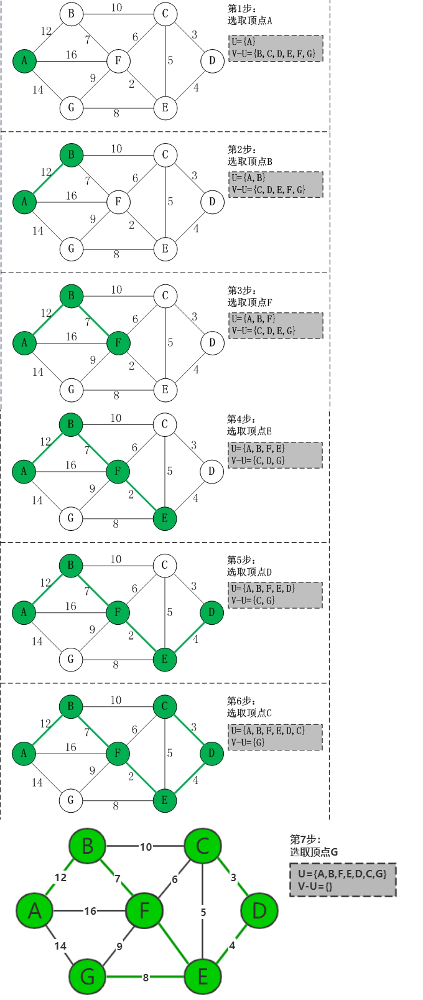

# 最小生成树

- 我们把构造连通网的最小代价生成树称为最小生成树
- 给定一个带权的无向连通图,如何选取一棵生成树,使树上所有边上权的总和为最小,这叫最小生成树

**一棵树**

1. 无回路
2. N 个顶点，一定有 N-1 条边

**生成树**

1. 包含全部顶点
2. N-1 条边都在图中

## 普里姆算法

参考

<https://www.cnblogs.com/ssyfj/p/9488723.html>

## 克鲁斯卡尔算法

1、将所有边的边权从小到大依次排列，并且均标为未选；

2、选择最小的未选边；

3、如果该边与前面所选的边无法构成回路，则选中该边，并标为已选；如果该边与前面所选的边构成了回路，则不选该边，并标为已选；

4、重复 2、3，直到所有点之间都有边相连；

参考：<https://www.jianshu.com/p/0bcddbb4a112>
