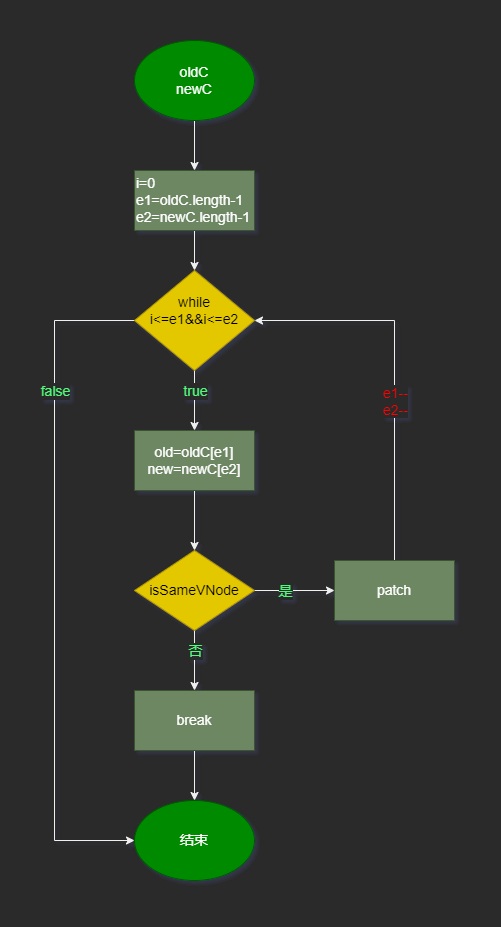
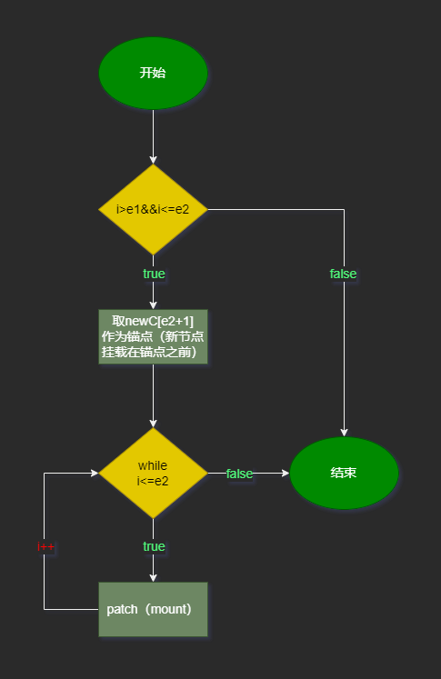
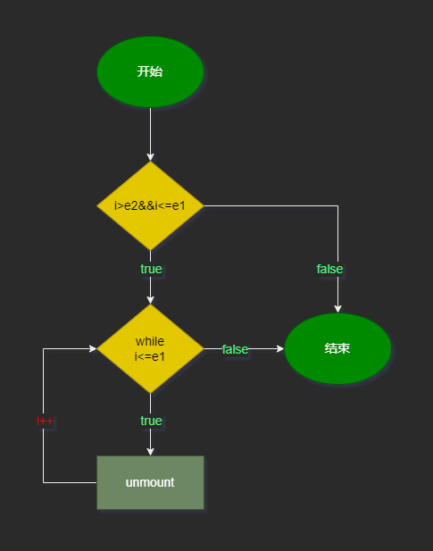
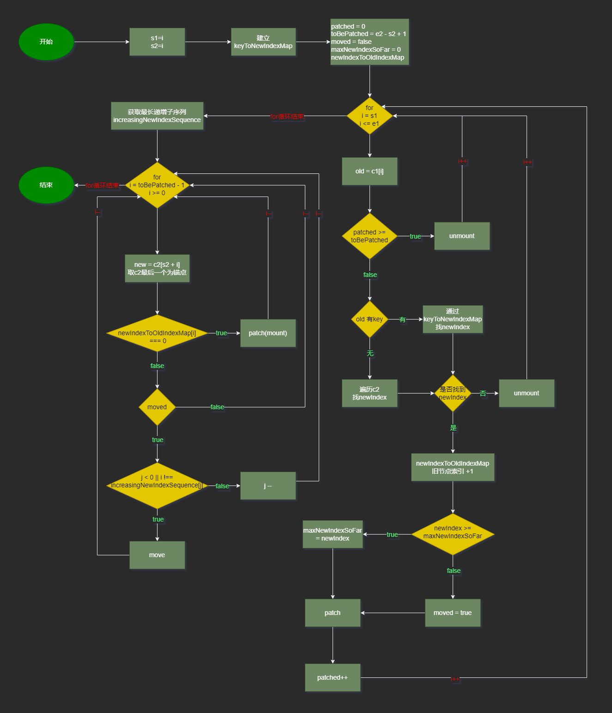

# diff

当组件发生更新时，为了能最大程度的复用旧节点，就需要比较新旧节点。子节点的比较是diff中最核心的问题

每一次新旧子节点的diff都会经过下面的5步，具体步骤如下

## 一

新旧子节点从头开始遍历，相同的patch

### 例1

新旧子节点如下：

```
oldChildren: a b c
newChildren: a b d e
```

### 流程图：


### 流程解析：

newC和oldC分别代表新旧子节点，每次循环取到新旧节点new和old，如果是相同节点，则patch，进入下一次循环；如果不是相同节点，则停止循环。对于上面的例子，循环结束时，i为2。即a,b已经通过步骤一处理了

## 二

新旧子节点从尾开始遍历，相同的patch

### 例2

新旧子节点如下：

```
oldChildren: a b c
newChildren: d e b c
```

### 流程图：



### 流程解析：

与第一步类似，只不过是从尾开始循环，循环结束时，e1为0，e2为1。

### 说明

例2在diff时不会进步骤一，因为从头开始遍历时，第一组新旧节点a和d就不满足相同节点

## 三

新节点mount

如果新旧子节点经过步骤一和步骤二后，旧子节点都遍历完了，但新子节点还没有遍历完，就说存在新增的子节点

例3

```
oldChildren: a b 
newChildren: a b c
```

例4

```
oldChildren: a b
newChildren: c a b
```

### 流程图



### 流程解析

通过 `i>e1 && i<=e2`来判断是否有需要新增的新子节点

### 例子说明

例3在开始diff后，会经过步骤一，再进入步骤三，不会进入步骤二

例4在开始diff后，会经过步骤二，在进入步骤三，不会进入步骤一

## 四

旧节点unmount

如果新旧子节点经过步骤一和步骤二后，新子节点都遍历完了，但旧子节点还没有遍历完，就说明有多余的子节点需要删除

例5

```
oldChildren: a b c
newChildren: a b
```

例6

```
oldChildren: a b c
newChildren: b c
```

### 流程图



### 流程解析

通过 `i>e2 && i<=e1`来判断是否有需要删除的旧子节点

### 例子说明

例5在开始diff后，会经过步骤一，再进入步骤四，不会进入步骤二

例6在开始diff后，会经过步骤二，在进入步骤四，不会进入步骤一

## 五

节点移动

### 例7

```
oldChildren：a b c d e f g
newChildren：a b e d c h f g
```

例7在开始diff后，先经过步骤一，此时：`i=2, e1=6, e2=7`，在经过步骤二，此时：`i=2, e1=4, e2=5`；旧的新的都没有遍历完，不会进第三步和第四步，那么进入第五步时：`i=2, e1=4, e2=5`。也就是实际在第五步需要处理的节点如下：

```
oldChildren：c d e
newChildren：e d c h
```

因为首尾的相同节点`a b`和`f g`已经在第一步和第二步patch了。

### 流程图



### 变量解析

- **keyToNewIndexMap**：用于存储新子节点key与索引的对应关系，
- **patched = 0**：表示已经patach的节点个数
- **toBePatched = e2 - s2 + 1**：需要patch的节点个数，例7中，toBePatched 为 4，即`e d c h` 4个
- **maxNewIndexSoFar = 0**：在旧子节点中找到新节点索引的最大值（类似react中的lastIndex），
- **moved = false**：表示是否需要移动节点，即新旧子节点位置发生了变化需要移动，
- **newIndexToOldIndexMap**：是个数组，长度为toBePatched，默认每一项都是0，用来存储新子节点中的未遍历的节点在旧子节点中的位置，后面将会使用它计算出一个最长递增子序列，并用于 DOM 移动，例7中，开始为`[0,0,0,0]`

### 流程解析

#### keyToNewIndexMap

- 这是为了之后在遍历旧子节点时，能够通过旧节点的key快速找到旧节点在新子节点中的位置。如果没有keyToNewIndexMap，那么在遍历旧子节点时时，只能再去遍历新子节点才能找到旧节点在新子节点中的位置，就会出现双层for循环。这就是算法优化中空间换时间的概念。例7中，keyToNewIndexMap形如：

```json
{
    e:2, // e在newChildren中的索引为2
    d:3,
    c:4,
    h:5
}
```

#### 第一个for循环

主要目的：

- 确定maxNewIndexSoFar 

例7中，maxNewIndexSoFar 为 4，因为e在旧节点中的索引为4，d在纠结点中的索引为3，c在节点中的索引为2，f在旧节点中不存在。取最大即为4。

- 确定newIndexToOldIndexMap

当找到了新节点在旧节点的位置，就把newIndexToOldIndexMap中对应的值设为旧节点索引 +1，在例7中，newIndexToOldIndexMap为`[5,4,3,0]`

- 确定moved

例7中，maxNewIndexSoFar 第一次就被设为了4，后面找到的索引 3,2都比4小，即说明有节点发生了位置交换，需要移动

#### 确定最长递增子序列

<https://en.wikipedia.org/wiki/Longest_increasing_subsequence>

在一个给定的数值序列中，找到一个子序列，使得这个子序列元素的数值依次递增，并且这个子序列的长度尽可能地大。最长递增子序列中的元素在原序列中不一定是连续的

`[0, 8, 4, 12, 2, 10, 6, 14, 1, 9, 5, 13, 3, 11, 7, 15]`

最长递增子序列为

`[0, 2, 6, 9, 11, 15]`

原始序列的最长递增子序列并不一定唯一

```
[0, 4, 6, 9, 11, 15]
[0, 4, 6, 9, 13, 15]
[0, 2, 6, 9, 13, 15]
```

这里不讨论求解最长递增子序列的算法。

#### 第二个for循环

做移动或mount操作

遍历toBePatched ，即需要path的节点，在例7中就是遍历`e d c h`

如果对应节点索引在newIndexToOldIndexMap中为0，即为新节点表示需要mount

没有最长递增子序列，或者不在最长递增子序列中的，表示需要move

## 总结

- 在一次diff中，步骤一、二可以都经历，但步骤三、四、五只会经历一个