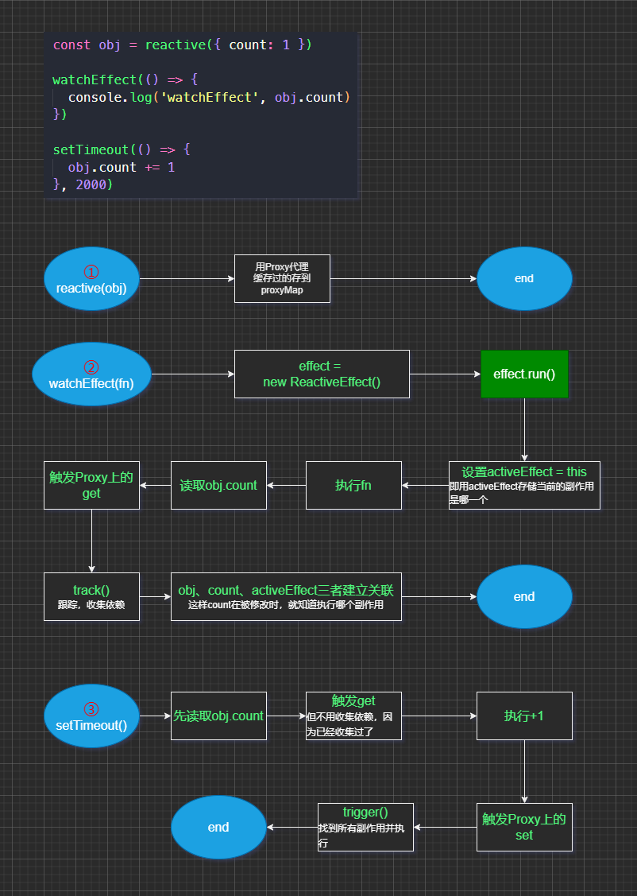

# reactive

1. 当一个值被读取时进行追踪

   - 例如 `val1 + val2` 会同时读取 `val1` 和 `val2`。

   - proxy 的 `get` 处理函数中 `track` 函数记录了该 property 和当前副作用

2. 当某个值改变时进行检测

   - 例如，当我们赋值 `val1 = 3`。
   - 在 proxy 上调用 `set` 处理函数。

3. 重新运行代码来读取原始值

   - 例如，再次运行 `sum = val1 + val2` 来更新 `sum` 的值
   - `trigger` 函数查找哪些副作用依赖于该 property 并执行它们

## proxy

### get

跟踪副作用：track

### set

运行副作用：trigger

## effect

只要有东西对数据变化做出奇妙的回应，你就可以肯定它已经被包裹在一个副作用中了

## track

它将检查当前运行的是哪个*副作用*，并将其与 `target` 和 `property` 记录在一起。这就是 Vue 如何知道这个 property 是该副作用的依赖项

## trigger

重新运行相关依赖的副作用

## 流程图

